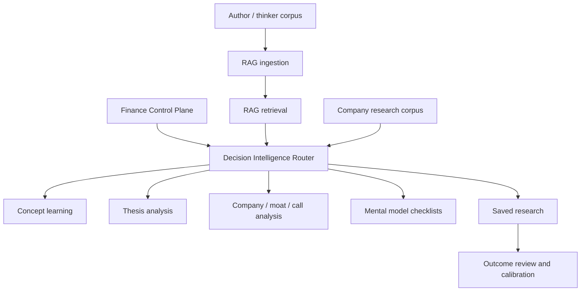

# PRD — CapitalOS Decision Intelligence Platform

This document consolidates and replaces:

- `PRD-Module-2-Investment-Intelligence-RAG.md`
- `PRD-module-2.1-intelligence-retrieval.md`
- `PRD-Platform-Intelligence-Strategy.md`

## Product Intent

CapitalOS Decision Intelligence helps improve investment judgment by combining:

- selected author/source ingestion
- grounded retrieval over those sources
- author mental models and checklists
- company and thesis analysis
- critique and red-team reasoning
- saved research that can compound over time

The goal is not to make a chatbot that sounds like famous investors. The goal is to build a personal capital-allocation partner that helps ask better questions, inspect evidence, apply better checklists, and make better investment decisions.

## Core User Goals

1. **Ingest authors and source material.**
   Build a curated corpus of investor, operator, strategy, and decision-making sources.

2. **Ask questions of that corpus.**
   Retrieve grounded passages and answer with citations.

3. **Use authors as a soundboard or board of advisors.**
   For a thesis, company, capital-allocation question, or portfolio decision, surface how different reasoning lenses would challenge or sharpen the decision.

4. **Turn mental models into checklists.**
   Use Munger-style inversion, incentives, psychology, margin of safety, base rates, moat, cycles, capital allocation, and other models as reusable decision checks.

5. **Improve investment work.**
   Apply the corpus and checklists to thesis analysis, company analysis, moat analysis, earnings-call analysis, portfolio review, and post-mortem learning.

6. **Make research reusable.**
   Save notes, checklists, thesis outputs, assumptions, falsifiers, and monitoring points so future work starts from accumulated judgment.

## Product Stance On AI Clones

Literal AI clones or personality roleplay are not the core product. They can sound compelling while still being weak for decision quality.

What helps more:

- evidence-grounded author lenses
- explicit mental-model checklists
- disagreement between lenses
- critique of unsupported claims
- saved assumptions and falsifiers
- later outcome review and calibration

A future “persona” layer may be useful as a UX wrapper if it makes interaction easier, but it should not replace citations, checklists, or auditability.

## Product Architecture

## Major Product Modes

### 1. Concept Learning

Example:

> What are the main mental models Charlie Munger uses?

The system should return:

- best cited passages
- distinct author perspectives when relevant
- synthesis
- critique
- suggested next readings
- optional saved checklist

### 2. Thesis Pressure Testing

Example:

> I think Tencent Music is attractive because...

The system should:

- identify the thesis claims
- retrieve relevant author mental models
- generate missing questions and blind spots
- fetch or use company evidence where available
- distinguish what strengthens vs weakens the thesis
- produce assumptions, falsifiers, and a monitoring checklist

### 3. Company Analysis

Examples:

- Evaluate Company X.
- What is the moat?
- What would Buffett, Munger, Marks, or Mauboussin care about?
- What did the latest call change?

The system should combine:

- company evidence
- author lenses
- valuation/business-quality questions
- risks and counterarguments
- reusable research notes

### 4. Capital Allocation Board

This is the “soundboard” mode.

The user brings a decision. The system assembles relevant lenses and asks:

- what would each lens emphasize?
- what are we missing?
- what assumption matters most?
- what would change our mind?
- what is the right checklist before acting?

This should feel like a capital-allocation partner, not roleplay.

### 5. Knowledge Compounding

The system should retrieve prior work:

- company notes
- thesis outputs
- checklists
- prior assumptions
- saved author references
- decision memos
- outcome reviews

This is what turns repeated use into an advantage.

## Current Implementation Status

Implemented or substantially started:

- author/source ingestion
- RAG ingestion, chunking, embeddings, and retrieval
- AI Sage persistent chats
- evidence cards with chunks and expanded context
- query planning, hybrid retrieval, reranking, and eval gates
- company thesis mode as an early pressure-testing path
- author/source-link oriented Author Library direction

Not yet fully implemented:

- reusable mental-model checklist objects
- explicit “capital allocation board” workflow
- saved research notes by company/topic/concept
- durable decision memo workflow
- company intelligence corpus for filings, transcripts, product updates, competitors
- earnings/concall analysis pipeline
- prior-thesis comparison
- outcome review and calibration records
- portfolio-level judgment engine combining holdings, company data, and author lenses

## Product Objects

### Research Note

Exploratory artifact.

Contains:

- question
- evidence
- observations
- cited author references
- optional extracted checklist items

### Mental Model Checklist

Reusable decision aid.

Contains:

- checklist name
- source author/model
- questions to ask
- failure modes
- examples
- linked citations

### Thesis Analysis

Structured pressure test.

Contains:

- thesis
- supporting evidence
- opposing evidence
- author-lens views
- assumptions
- falsifiers
- monitoring checklist
- confidence

### Decision Memo

Durable judgment artifact.

Contains:

- decision question
- recommendation
- confidence
- evidence
- lens outputs
- synthesis
- critique
- assumptions
- falsifiers
- monitoring checklist

### Outcome Review

Learning artifact.

Contains:

- linked decision memo
- what happened
- what was right
- what was wrong
- which assumptions held or failed
- calibration notes

## Relationship To RAG Architecture

The RAG implementation details live under `docs/RAG/`:

- [AI Sage product architecture](./docs/RAG/ai-sage-product-architecture.md)
- [Ingestion](./docs/RAG/ingestion.md)
- [Retrieval](./docs/RAG/retrieval.md)
- [Evals](./docs/RAG/evals.md)

Those docs explain how source material becomes retrievable evidence. This PRD explains why the evidence exists and how it should improve investment judgment.

## Relationship To Finance Control Plane

The Finance Control Plane answers factual portfolio questions from structured data.

Decision Intelligence uses that data only when judgment requires portfolio context, for example:

- which holdings deserve review?
- which positions violate a checklist?
- where is concentration risk high?
- which company thesis should be updated after new evidence?

## Design Choices

1. **Evidence before synthesis.**
   Answers should be grounded in source passages or structured data.

2. **Mental models become checklists.**
   The product should transform author wisdom into repeatable decision questions.

3. **Author lenses preserve useful disagreement.**
   The system should not flatten Buffett, Munger, Marks, Mauboussin, operators, and strategy writers into one generic voice.

4. **Company analysis needs company evidence.**
   Author wisdom alone is not enough to analyze a live business.

5. **Research must compound.**
   Saved notes, checklists, and thesis artifacts are product primitives, not nice-to-have chat history.

## What Your Current Goal List Captures

Your list captures the essential product:

- corpus ingestion
- corpus Q&A
- capital allocation soundboard
- mental-model checklists
- possible author/personality interfaces
- investment analysis improvement

## Additional Useful Goals From The Older PRDs

Important ideas not fully captured in the short goal list:

- separate structured finance facts from RAG answers
- keep company evidence separate from author evidence
- save reusable research artifacts instead of losing answers in chat history
- track assumptions and falsifiers
- support future outcome reviews and confidence calibration
- route queries to the right data plane instead of using one generic assistant for everything

## Delivery Order

1. Stabilize RAG evidence quality.
2. Build mental-model checklist extraction and storage.
3. Build thesis/company pressure-testing around those checklists.
4. Save and retrieve research by company/topic/concept.
5. Add company corpus ingestion for transcripts, filings, presentations, and product updates.
6. Add decision memos and outcome review.
7. Add portfolio-level judgment workflows using Finance Control Plane data.

## Success Criteria

The platform is working when:

- concept answers are better than generic ChatGPT because they cite the right passages
- broad author questions return actual mental models, not shallow keyword matches
- thesis mode surfaces non-obvious blind spots
- company analysis uses both company evidence and author checklists
- useful outputs are saved and reused later
- repeated use improves future analysis instead of starting from zero
