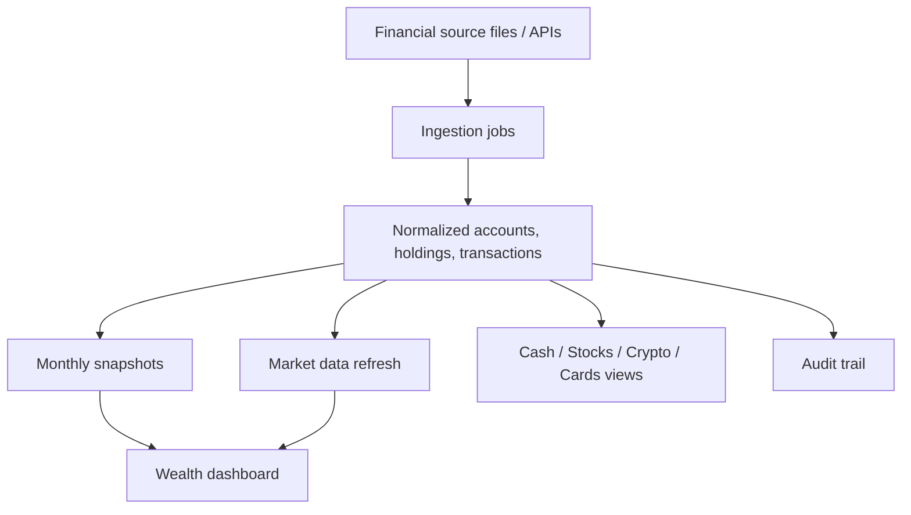

# PRD — CapitalOS Finance Control Plane

This document replaces `PRD-Module-1.md`.

## Product Intent

The Finance Control Plane is the structured-data foundation of CapitalOS. It gives a reliable view of personal capital, spending, holdings, market data, and snapshots.

Target investment-account schema: [Canonical Portfolio Data Model](docs/finance/canonical-portfolio-model.md).

It answers factual questions such as:

- What is my net worth?
- How is my capital allocated?
- Where is risk concentrated?
- How much cash do I have by currency?
- How much stock exposure do I have by geography?
- What changed since the last snapshot?
- What did I spend, save, or receive?

This layer is not RAG-first. It is database-first.

## Why

CapitalOS needs one trusted financial source of truth before higher-level intelligence can reason about portfolio decisions. AI can explain or summarize this data, but computed values must come from structured records, not from embeddings or generated text.

## Scope

In scope:

- net worth dashboard
- cash, stocks, crypto, credit cards, dividends, market data
- account/platform tracking
- file-based ingestion and reconciliation
- portfolio snapshots
- asset allocation and concentration
- geography and currency breakdowns
- spending categories and savings-rate views
- auditability from source file to computed value

Out of scope:

- author corpus ingestion
- investment thesis analysis
- author-lens reasoning
- autonomous trading
- broad AI recommendations
- replacing deterministic calculations with RAG

## Architecture

## Core Product Areas

### Wealth Overview

Shows current net worth and allocation across cash, stocks, crypto, and other tracked assets.

Expected breakdowns:

- asset class
- geography
- currency
- platform/account
- top holdings
- six-month trend where useful

### Cash

Shows current cash total, currency breakdown, last snapshot comparison, and trendline.

### Stocks

Shows current stock exposure by geography such as US, HK, SG, and IN, with current market values and snapshot comparison.

### Crypto

Shows current value, prior snapshot value, refresh movement, exposure by chain, and exposure by wallet.

### Spending And Cards

Shows spend by category, savings rate, recurring payments, card usage, and transaction-level detail.

### Market Data

Market prices should refresh in a complete, auditable batch. Partial stale refreshes are a product problem because they make portfolio values misleading.

## Key Design Choices

1. **Structured data is authoritative.** Finance facts come from normalized tables and snapshots.
2. **Snapshots anchor history.** Historical comparisons use the configured snapshot day.
3. **Every number is auditable.** Computed values should trace back to source rows or refresh jobs.
4. **AI is explanation, not authority.** AI can narrate or summarize, but not invent balances or holdings.
5. **Local-first remains the default posture.** The system should be deterministic and reproducible where possible.

## Relationship To Decision Intelligence

The Finance Control Plane becomes an input to the Decision Intelligence Platform. For example:

- “Which holdings deserve deeper review?”
- “Which portfolio names look weakest under a second-level-thinking checklist?”
- “Where is my geographic exposure too concentrated?”

Those questions require structured finance data plus company/thinking intelligence. The raw portfolio facts remain owned by this PRD.
