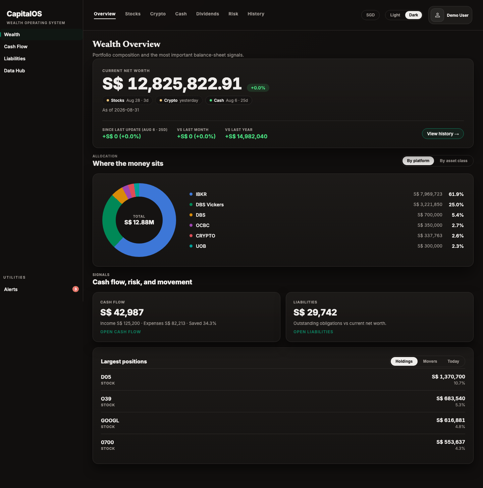
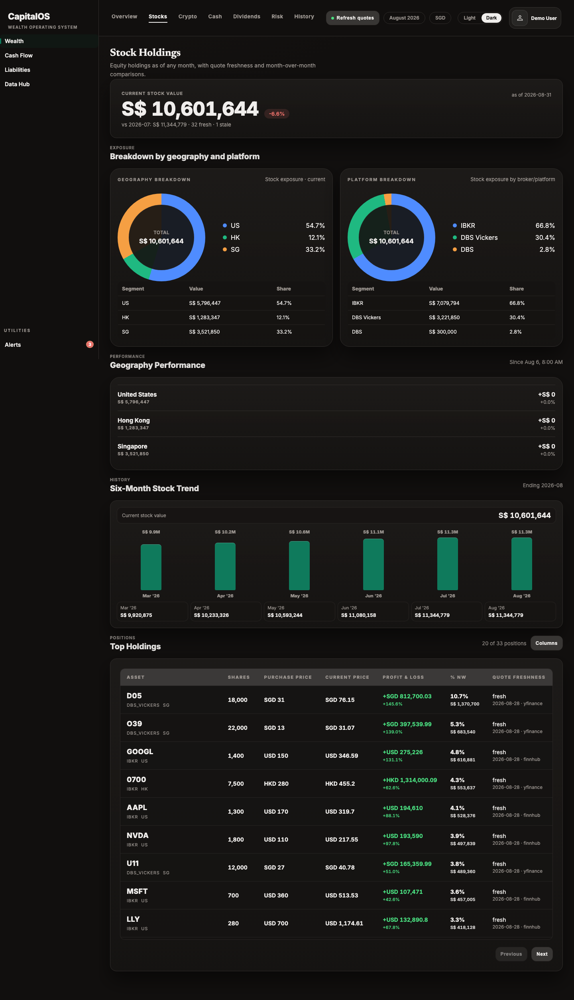
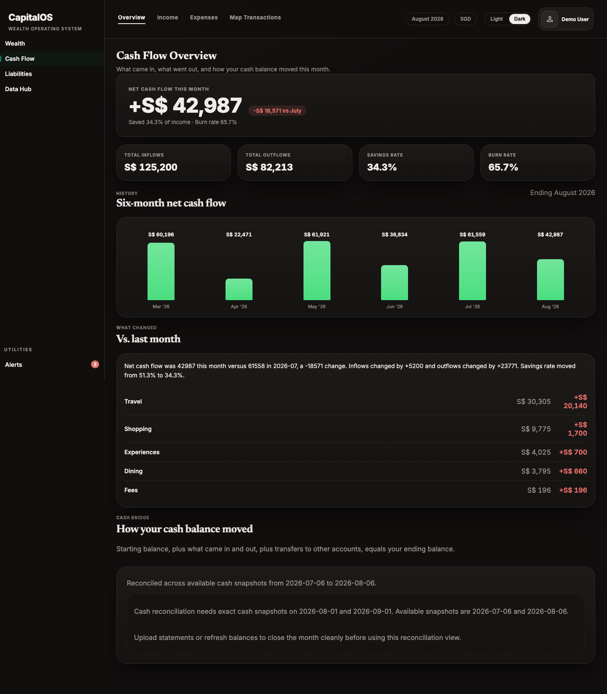
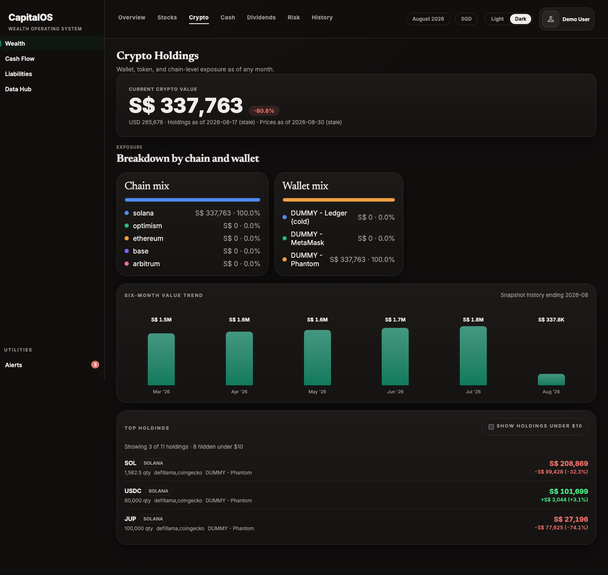

# CapitalOS

CapitalOS is a local-first, open-source personal capital operating system.

It provides a unified view of net worth, asset allocation, concentration risk, and spending behavior across multiple asset classes and financial accounts. The long-term goal is to build infrastructure for disciplined capital allocation and AI-assisted analysis, while keeping judgment, traceability, and process at the center.

CapitalOS is not a budgeting app and not a trading bot.

It is infrastructure for understanding:

- where your capital is
- how it is allocated
- where risk is concentrated
- how decisions are made
- how outcomes feed back into future judgment

The project emphasizes correctness, traceability, and process over prediction.

---

## Screenshots

All screenshots below are the seeded demo account (`demo` / `Test@1234`) —
dummy accounts, dummy wallets, fabricated balances. See
[`docs/screenshots/`](docs/screenshots/) for the full set of every screen.

**Wealth Overview** — net worth, allocation by platform, largest positions


**Stock Holdings** — geography/platform exposure, six-month trend, positions


**Cash Flow Overview** — inflows/outflows, savings rate, month-over-month


**Crypto Holdings** — chain/wallet exposure, six-month trend, top holdings


---

## Core Principles

- **Local-first**: Runs on your machine.
- **Source-of-truth driven**: Every number should trace back to a file, account, or on-chain address.
- **Judgment over automation**: Systems support decisions; they do not replace them.
- **Process-oriented**: Outcomes should be comparable against original intent.
- **Composable**: Modules can evolve independently.
- **Open by design**: Built for learning, experimentation, and transparency.

---

## What CapitalOS Is

CapitalOS is a foundation for building:

- a personal financial system of record
- portfolio visibility across multiple asset classes
- ingestion and normalization pipelines
- decision support tooling
- future AI-assisted workflows for analysis, review, and process improvement

---

## What CapitalOS Is Not

- Not a robo-advisor
- Not a trading platform
- Not a forecasting engine
- Not a consumer budgeting app
- Not a system that automates financial judgment away from the user

---

## Product Direction

CapitalOS is organized into several conceptual layers.

### Module A — Personal Financial Brain
Structured visibility into:

- portfolio across asset classes and geographies
- bank balances
- credit cards
- spending

Outputs include:

- net worth
- asset allocation
- savings rate
- burn rate
- concentration and risk visibility

This answers questions such as:

- What is my net worth?
- Where is my capital allocated?
- How am I spending?
- Where is risk concentrated?

### Module B — Market Intelligence Engine (future)
Ingests:

- earnings transcripts
- filings
- news
- product updates
- competitor announcements

Produces:

- company summaries
- competitive shifts
- risk signals
- sector trends

---

## Technology Stack

Current stack:

- **Backend**: FastAPI (Python)
- **Frontend**: React + TypeScript
- **Database**: PostgreSQL
- **Local runtime**: Docker Compose
- **Workflow orchestration**: LangGraph + Pydantic

The application is local-first today, but structured so it can later be migrated to managed infrastructure if needed.

---

## Repository Structure

High level:

- `app/` — backend application
- `web/` — frontend application
- `migrations/` — database migrations
- `data/` — local raw files, fixtures, and reports
- `tasks/` — human-facing issue/task markdown files
- `orchestration/` — LangGraph workflow, typed models, nodes, services, prompts, tests

---

## Getting Started

### Prerequisites

- Docker + Docker Compose
- Python 3.11+ recommended
- Node.js / npm
- Make

Optional, for AI workflow features:

- GitHub CLI (`gh`)
- Copilot CLI / builder tooling used by your orchestration services

---

## Quickstart

No environment variables are required to get running. Market data price
refresh works out of the box (a free/keyless provider is the default
fallback); crypto wallet tracking and IBKR auto-sync need their own API
keys to work at all, but everything else is unaffected if you skip them —
see [`docs/setup/api-keys.md`](docs/setup/api-keys.md) for exactly which
keys unlock what, and where to get each one.

```bash
# 1. (optional) copy the env template if you want to add provider API keys
cp .env.example .env

# 2. build the images
make build

# 3. start Postgres + the API (and run migrations)
make up
make db-migrate

# 4. (optional) seed rich demo data — net worth, spending, crypto, 12mo history
make db-seed-dummy

# 5. start the frontend dev server
cd web && npm install && npm run dev
```

- **Frontend**: http://localhost:5173
- **API**: http://localhost:8000 (health: `curl http://localhost:8000/health`, docs: `/docs`)
- **Log in** with the seeded demo account — `demo` / `Test@1234` — or register a new
  user from the signup screen and start tracking your own portfolio.

Stop everything with `make down`. The reset target under Development
Workflow below wipes the database — back up first, see
[`docs/setup/backups.md`](docs/setup/backups.md).

---

## Running the Application

### 1. Start local services

```bash
make up
```

Wait for services to be ready (Postgres, API, Web).

### 2. Stop services

```bash
make down
```

Stops all running containers.

### 3. Verify API health

```bash
curl http://localhost:8000/health
```

### 4. Access the application

- **Frontend**: http://localhost:5173
- **API docs**: http://localhost:8000/docs
- **OpenAPI spec**: http://localhost:8000/openapi.json

### 5. Run initial migrations

```bash
make db-migrate
```

### 6. (Optional) Seed dummy data

```bash
make db-seed-dummy
```

### 7. (Optional) Logs and observability

A Grafana + Loki + Alloy stack ships in `docker-compose.yml` behind an `observability`
profile, so it doesn't start with a plain `make up`. Bring it up with:

```bash
docker compose --profile observability up -d loki grafana alloy
```

- **Grafana**: http://localhost:3000 (login `admin` / `capitalos`, or override via
  `GRAFANA_ADMIN_USER` / `GRAFANA_ADMIN_PASSWORD` in `.env`) — the Loki datasource is
  pre-provisioned, so **Explore → Loki** shows live container logs immediately.
- **Loki API** (for scripting/`curl`): http://localhost:3100

Alloy tails every container's logs directly off the Docker socket and keeps any
container whose Compose project name starts with `capitalos` (see
`config/alloy/config.alloy`) — so it picks up `capitalos-api`/`capitalos-postgres`
from the main stack as well as any `capitalos-oss-test-*` / dev/test stacks running
alongside it, with no extra wiring per stack. Filter by the `container` or `service`
label in Grafana to scope to one component.

Stop just the observability stack (without touching Postgres/API) with:

```bash
docker compose --profile observability stop loki grafana alloy
```

---

## AI Task Pipeline

CapitalOS uses a LangGraph-based AI task orchestration pipeline for feature development.

### Pipeline Modes

- **v2 (existing)**: multi-stage plan/build/review/rework flow with explicit human gates.
- **v3 (new, opt-in)**: unified long-run `agent_run` + deterministic safety gates, optimized for lower premium-request usage.

Mode is selected by config:

```bash
PIPELINE_VERSION=v2   # default
PIPELINE_VERSION=v3
```

### Pipeline Overview

The pipeline consists of seven core stages:

1. **prepare** — Ensure task file exists, switch to issue branch, bootstrap workflow context
2. **plan** — Generate structured implementation plan with acceptance criteria
3. **human_approval_gate** — Mandatory human review of plan before build
4. **build** — Implement feature, run verification suite, stage scoped changes
5. **agent_review** — Model reviews build output, approves or requests fixes
6. **human_review** — Human review after agent review
7. **ship** — Commit, push, and optionally open PR

If fixes are needed, the **rework** stage analyzes findings and re-implements, then returns to review loop.

### V3 Unified Long-Run Flow (Opt-In)

When `PIPELINE_VERSION=v3`, orchestration uses:

1. `prepare`
2. `agent_run` (single long-running provider session: understand task, plan, implement, update tests, run relevant tests, fix failures, rerun until green or truly stuck)
3. `deterministic_gates` (verification-only rerun of relevant backend/frontend/pipeline checks + scope/secrets/restricted-path policy)
4. `ship`

If deterministic gates fail:

- the workflow blocks with actionable failure details.
- deterministic gates do not launch another model run.

Out-of-scope files are allowed only with explicit per-file reasons. Restricted paths (e.g. `.gitignore`, fixtures paths, secret-like content) hard-fail.

### Running a Task

```bash
# Prepare the task and branch
make task-prepare TASK=tasks/issue-123-my-feature.md THREAD_ID=issue-123

# Generate implementation plan
make task-plan TASK=tasks/issue-123-my-feature.md THREAD_ID=issue-123

# Approve the plan (after human review)
make task-approve-plan TASK=tasks/issue-123-my-feature.md THREAD_ID=issue-123 RESUME_JSON='{"decision":"approved",...}'

# Build the feature
make task-build TASK=tasks/issue-123-my-feature.md THREAD_ID=issue-123

# Agent review
make task-agent-review TASK=tasks/issue-123-my-feature.md THREAD_ID=issue-123

# Human review (after agent review)
make task-human-review TASK=tasks/issue-123-my-feature.md THREAD_ID=issue-123 RESUME_JSON='{"decision":"approved",...}'

# Ship the feature
make task-ship TASK=tasks/issue-123-my-feature.md THREAD_ID=issue-123
```

Or run all stages end-to-end (with gates):

```bash
make task-all TASK=tasks/issue-123-my-feature.md THREAD_ID=issue-123
```

Run the v3 flow end-to-end:

```bash
make task-v3-run TASK=tasks/issue-123-my-feature.md THREAD_ID=issue-123
```

Resume a blocked v3 run:

```bash
make task-v3-resume TASK=tasks/issue-123-my-feature.md THREAD_ID=issue-123 RESUME_JSON='{"decision":"approved","reviewer":"...","notes":"..."}'
```

For complete workflow documentation, see [`docs/workflows/ai-task-flow.md`](docs/workflows/ai-task-flow.md).

Driving Claude Code from a phone (no laptop in front of you)? See
[`docs/workflows/remote-dev.md`](docs/workflows/remote-dev.md).

---

## Verification Commands

### Run all quality gates

```bash
make verify
```

This runs:
- Linting (ruff for Python, eslint for TypeScript)
- Type checking (mypy for Python, tsc for TypeScript)
- Backend tests (pytest)
- Frontend tests (vitest)

### Individual verification commands

```bash
# Lint code
make lint

# Type check
make typecheck

# Run backend tests
make test-backend

# Run frontend tests
make test-frontend

# Run E2E tests (if configured)
make e2e
```

### Database verification

```bash
# Check database connectivity
make db-wait

# Query database
make db-query QUERY='SELECT * FROM accounts LIMIT 5;'

# Open database shell
make db-shell
```

### API smoke tests

```bash
# Quick API health check
make api-smoke

# Test ingestion pipeline (requires account)
make ingest-smoke

# Test crypto endpoints
make crypto-smoke
```

---

## Development Workflow

### Making changes

1. Create a task file: `tasks/issue-<id>-<slug>.md`
2. Run `make task-all TASK=<task-file> THREAD_ID=<thread-id>`
3. Review output and respond to gates as needed
4. Verify changes: `make verify`
5. Ship when approved: `make task-ship TASK=<task-file> THREAD_ID=<thread-id>`

### Rebuilding services

```bash
# Rebuild API container
make api-rebuild

# Rebuild web container
make web-rebuild
```

### Resetting database

```bash
# WARNING: This destroys all data — back up first: docs/setup/backups.md
make db-reset
```

### Backing up / restoring database

```bash
make db-backup                                    # writes backups/capitalos_<timestamp>.dump
make db-restore BACKUP_FILE=backups/capitalos_<timestamp>.dump
```

See [`docs/setup/backups.md`](docs/setup/backups.md) for automating this on a schedule.

---

## Project Structure

```
capitalos/
├── api/                    # FastAPI backend
│   ├── app/                # Application code
│   │   ├── models/         # SQLAlchemy models
│   │   ├── routers/        # API endpoints
│   │   ├── services/       # Business logic
│   │   └── main.py         # FastAPI app
│   ├── tests/              # Backend tests
│   └── Dockerfile
├── web/                    # React frontend (Vite)
│   ├── src/
│   │   ├── components/     # React components
│   │   ├── types/          # TypeScript types
│   │   └── main.tsx        # Entry point
│   ├── package.json
│   └── Dockerfile
├── migrations/             # SQL migrations
├── orchestration/          # LangGraph task pipeline
├── tasks/                  # Task definition files
├── docs/                   # Documentation
├── docker-compose.yml      # Service orchestration
├── Makefile                # Build and task commands
└── ReadMe.md               # This file
```

---

## Contributing

1. Follow the project principles in AGENTS.md
2. Use the AI task pipeline for all features
3. Ensure all changes pass `make verify`
4. Keep changes scoped and deterministic
5. Never break the API contract

---

## License

AGPL-3.0. See [LICENSE](LICENSE) for the full text. This means anyone who
modifies this code and runs it as a network service (e.g. a hosted/SaaS
offering) must make their modified source available to users of that
service — not just when they distribute the code.
