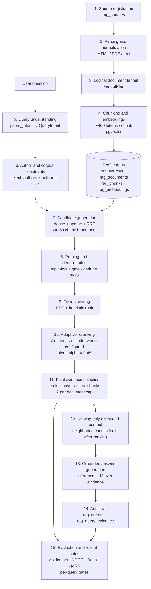

# AI Sage Product Architecture

AI Sage is the intelligence layer of CapitalOS. It turns a curated corpus of author material into a persistent research workspace with auditable retrieval, evidence-first answers, and direct links back to original source URLs.

The high-level product PRD is [CapitalOS Decision Intelligence](../../PRD-CapitalOS-Decision-Intelligence.md). This document is the current source of truth for the AI Sage product shape and end-to-end pipeline.

Detailed architecture references:

- [Ingestion Architecture](./ingestion.md)
- [Retrieval Architecture](./retrieval.md)
- [Evaluation Architecture](./evals.md)

---

## What AI Sage Is

AI Sage is a retrieval-first investment judgment workflow:

- users ingest external author and source material
- the system parses, chunks, embeds, and audits that corpus
- users ask questions in persistent AI Sage chats
- answers are grounded in retrieved and ranked evidence
- evidence cards show the exact chunk text, expanded surrounding context, and a link to the original source URL
- mental models become reusable checklist material
- author lenses provide a structured view into how each thinker frames a question

Author Library is intentionally simple for now: authors and their external source links. Full in-product document rendering is not the current direction.

## Why Retrieval Quality Is The Core Concern

The value is a disciplined research loop where every answer can be inspected and its quality verified:

- what corpus was searched and why
- what query plan the system built
- which passages were retrieved and ranked, and in what order
- how reranking changed that order
- whether a configuration change improved or degraded known important questions

This makes retrieval quality, ranking transparency, and auditability the primary architecture concerns.

---

## End-To-End Pipeline

The 15 stages of the AI Sage pipeline, in order:

---

### Stage 1 — Source Registration

The user adds author source URLs (or manual text) through the Author Library UI or config-driven sync. Each registered source is stored in `rag_sources` with its URL, source type (`html`, `pdf`, `text`, `manual`), author association, and ingestion status. Source types are detected from the URL response content-type.

### Stage 2 — Parsing and Normalization

The fetcher downloads the source and the parser converts raw bytes into structured sections. Parser paths by source type:

- **HTML**: DOM normalization that extracts headings, body text, links, and structural sections.
- **PDF**: Unstructured-first policy with an explicit fallback path. Parser metadata records which backend was used and whether fallback occurred.
- **Text / Manual**: Plain normalization path.

Normalization preserves headings, section paths, table content (as Markdown), list items, figure captions, and modality metadata. Structure that survives parsing produces better retrieval evidence.

### Stage 3 — Logical Document Fanout

A single source may contain multiple distinct works (e.g., a compendium PDF or archive page containing many separate letters). A `FanoutPlan` identifies how many logical documents to produce from one source. Each logical document becomes a separate `RagDocument` row with its own title, author, publication date, and content. Single-work sources produce one document; compendiums fan out into many.

### Stage 4 — Chunking and Embeddings

Each logical document is split into retrieval-sized chunks (~400 tokens target) using a two-tier chunker:

1. **Recursive character chunking** (always active): splits by paragraphs → sentences → words with configurable overlap and tiktoken-based token counting.
2. **Semantic chunking** (optional, `RAG_CHUNKING_SEMANTIC=1`): detects topic shifts via adjacent sentence embedding similarity and only splits at genuine boundaries.

Each chunk is embedded using the configured embedding provider (provider-isolated, deterministic mock mode available for tests) and stored in `rag_embeddings` with the model name recorded.

Chunk metadata records: author, source URL, document title, section path, 0-based chunk index, parser path, source type, embedding model, and content modality.

### Stage 5 — Query Understanding

Every query goes through `parse_intent()` before retrieval, producing a `QueryIntent`:

| Field | Meaning |
|---|---|
| `query_type` | `single_author`, `multi_author`, `broad`, or `company` |
| `author_ids` | Detected author IDs (e.g. `warren_buffett`, `charlie_munger`) |
| `author_names` | Display names for those authors |
| `source_types` | Optional source-type hints from the query |
| `date_from` / `date_to` | Year range extracted from the query |
| `topic_entities` | Concept or entity phrases from the content part of the query |
| `sub_queries` | Decomposed sub-questions for broad comparison queries |

The intent parser first tries a cheap routing LLM (configured via `ROUTING_LLM_MODEL`); falls back to a pure-Python text parser if unavailable.

**Key design point:** author names in the query become corpus filters, not relevance terms. A query like "What does Munger say about inversion?" routes into Munger's corpus and searches for "inversion" content. Chunks are not ranked by how often they say "Munger."

### Stage 6 — Author and Corpus Constraints

`select_authors()` picks which authors' corpora to search. For `single_author` queries it pins to exactly the detected author. For broader queries it scores all known authors and takes the top-k most relevant.

Source type is intentionally **not** used as a hard retrieval filter. Filtering by source type would reduce the candidate pool and hurt recall. Source type is surfaced in evidence metadata so the user can verify the origin.

### Stage 7 — Candidate Generation

A broad pool of 24–60 candidate chunks is assembled before any ranking:

- **Dense search**: pgvector cosine similarity over stored embeddings under the author filter.
- **Sparse search**: Postgres full-text search. Author names and year numbers are stripped from the query before this step to prevent AND-conjunction mismatches.
- **Topic-focus search**: when `topic_entities` are detected, a separate retrieval pass runs using only those entity terms as the query.
- **Sub-query expansion**: for broad comparison queries, each detected sub-query runs its own dense+sparse pass.

All pools are merged by **Reciprocal Rank Fusion (RRF)** in `hybrid` mode (the default). **Retrieval hardening** (`RAG_RETRIEVAL_HARDENING=1`, enabled by default) prunes each pool independently using the retrieval query plan before fusion.

### Stage 8 — Pruning and Deduplication

**ID-level deduplication**: the same chunk ID cannot appear twice in the pool.

**Topic-focus gate**: when `topic_entities` are non-empty, chunks with zero phrase or token matches against those entities are removed. The gate activates only when (a) at least `min(6, broad_top_k, 10)` chunks survive and (b) at least 2 chunks in the pool contain at least one exact topic phrase. Below these thresholds the full pool proceeds.

**Strict author gate**: for explicit single-author queries (user names the author), chunks from other authors are removed after all candidate pools are merged.

### Stage 9 — Fusion Scoring

The heuristic ranker scores each candidate using lexical overlap with query keywords, topic entity phrase hits and token hits, cosine similarity, and optional metadata weighting (`RAG_METADATA_WEIGHTING_ENABLED`). RRF-combined scores from hybrid retrieval flow into this ranking as a pre-sorted input.

### Stage 10 — Adaptive Reranking

When `RAG_RERANKER_PROVIDER=jina` (and `JINA_API_KEY` is set), the Jina cross-encoder reranker scores each `(query, passage)` pair. Default model: `jina-reranker-v2-base-multilingual`.

**Input mode** options: `raw` (anchor text only), `compact_context` (title + heading + truncated text, ≤900 chars), or `expanded_context` (full neighbor context).

**Adaptive fusion** blends heuristic rank and reranker score:

| Mode | When | Behavior |
|---|---|---|
| `pure` | Broad synthesis or explicit author-attribution queries with ≥8 candidates and ≥2 phrase-support chunks | Reranker score alone determines order |
| `conditional_blend` | All other queries | `(1 − alpha) × heuristic_rank + alpha × reranker_score`, alpha = 0.45 by default |

If the Jina call fails, the pipeline falls back silently to the heuristic ranking.

### Stage 11 — Final Evidence Selection

`_select_diverse_top_chunks()` applies a per-document cap (default: 2 chunks per document) to prevent one document from filling all evidence slots. Chunks are sorted by `ranking_sort_key` (reranker score when available, otherwise weighted score, otherwise cosine distance).

### Stage 12 — Display-Only Expanded Context

**After** ranking and deduplication are complete, `expand_chunks_with_context()` retrieves neighboring chunks (window: ±2 chunks, max 1800 chars total) from `rag_chunks` to assemble display context around each winner.

Expanded context is attached as `context_text` in evidence metadata and shown when a user requests it in the UI. It does not affect which chunks were selected or their order. Parent chunks and neighboring chunks fetched here do not re-enter the candidate pool.

### Stage 13 — Grounded Answer Generation

The inference LLM (`INFERENCE_LLM_MODEL`) receives the user query and ranked evidence as the answer context. When fewer than `_MIN_CHUNKS_FOR_CONFIDENCE = 2` chunks are retrieved, the response includes a `weak_evidence_note` surfacing the corpus gap honestly.

An optional critique (`AI_SAGE_CRITIQUE_ENABLED`, disabled by default) generates substantive pushback on what the retrieved evidence may miss.

### Stage 14 — Audit Trail

Every `execute_concept_query()` call logs to `rag_queries` and `rag_query_evidence` via `log_query()`:

- query text and parsed intent
- selected authors
- retrieved evidence chunk IDs with cosine distance, RRF score, reranker score, and pool memberships
- answer text and latency
- retrieval configuration at the time of the call

The `diagnose-query` CLI command replays the live pipeline for a single query and writes a full stage-by-stage trace to a file, accessible via `./data/` on the host.

### Stage 15 — Evaluation and Rollout Gates

Retrieval quality is measured against a golden set of curated query–passage pairs. The fixture lives at `api/app/rag/eval/fixtures/rag_golden_queries.yaml`.

A configuration change becomes the default only when it does not regress below the no-regression bar (`NDCG@10 delta ≥ −0.02` and `Recall@10 delta ≥ −0.02` vs baseline) **and** passes per-query gates for all queries with sufficient golden coverage.

See [Evaluation Architecture](./evals.md) for full metric definitions, formulas, and the rollout decision workflow.

---

## Design Choices

1. **Author names are filters, not relevance terms.** A Munger query routes into Munger's corpus and searches for the concept. Chunks are not ranked by how often they mention "Munger."
2. **Source type is a display preference, not a hard retrieval filter.** Filtering would reduce the candidate pool and hurt recall.
3. **Retrieval quality comes before synthesis.** Bad evidence cannot be fixed by fluent answer generation.
4. **Rerankers are provider-swappable.** Provider selection is via `RAG_RERANKER_PROVIDER`. Provider logic is isolated in `reranker.py`.
5. **Evaluation gates protect defaults.** Aggregate improvement alone is not enough; per-query gates must pass.
6. **Context expansion is display-only and happens after ranking.** Neighboring chunks do not re-enter the candidate pool.
7. **Audit trails are production requirements.** Every query and its pipeline decisions are logged and inspectable.

---

## Not Yet Implemented

The RAG and retrieval foundation exists. These higher-level product capabilities are not yet built:

- reusable mental-model checklist objects
- capital allocation board workflow (structured multi-author comparison)
- saved research by company, topic, or concept
- company intelligence corpus (filings, transcripts, product updates)
- thesis comparison against prior research
- outcome reviews and calibration records
- portfolio-level judgment workflows using Finance Control Plane data

---

## Glossary

| Term | Definition |
|---|---|
| **Author** | A named corpus owner (e.g. Warren Buffett, Charlie Munger) whose source material is ingested and searched |
| **Source** | One URL or manual document attached to an author |
| **Logical document** | One user-meaningful work produced from a source (a letter, essay, speech) |
| **Fanout** | Splitting one source into multiple logical documents |
| **Chunk** | A retrieval-sized text passage (~400 tokens) produced from a logical document |
| **Anchor chunk** | The chunk selected as ranked evidence |
| **Expanded context** | Neighboring chunks assembled around an anchor chunk for display only — not used in ranking |
| **Embedding** | A vector representation of a chunk used for dense semantic search |
| **Dense search** | pgvector cosine similarity over embeddings |
| **Sparse search** | Postgres full-text search using `websearch_to_tsquery` |
| **RRF** | Reciprocal Rank Fusion — combines multiple ranked lists without score normalization |
| **Candidate pool** | The broad set of chunks assembled before ranking (24–60 chunks) |
| **Retrieval hardening** | Pre-fusion quality pruning that removes clearly off-topic chunks |
| **Cross-encoder reranker** | A model that scores `(query, passage)` pairs together; more accurate than embedding distance alone |
| **Adaptive blend** | Mixing heuristic rank and cross-encoder score using a tunable alpha (default 0.45) |
| **Pure rerank** | Using cross-encoder score alone, with no heuristic blend |
| **Topic-focus gate** | Post-deduplication filter that keeps only topic-matching chunks, active only when phrase support is sufficient |
| **Diversity cap** | Per-document limit (default 2) preventing one document from filling all evidence slots |
| **Golden set** | Curated query–passage pairs used to measure retrieval quality |
| **No-regression bar** | NDCG@10 delta ≥ −0.02 and Recall@10 delta ≥ −0.02 vs baseline |
