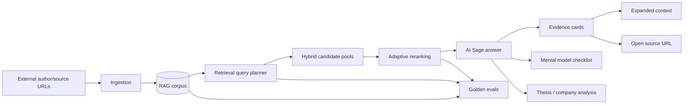

# AI Sage Product Architecture

AI Sage is the umbrella product for CapitalOS intelligence. It turns a curated author corpus into a persistent research workspace with auditable retrieval, evidence-first answers, and links back to original source URLs.

The high-level product PRD is [CapitalOS Decision Intelligence](../../PRD-CapitalOS-Decision-Intelligence.md). This document explains the RAG-backed AI Sage workflow underneath that product direction.

This is the current source of truth for the AI Sage product shape. The deeper architecture pages are:

- [Ingestion](./ingestion.md)
- [Retrieval](./retrieval.md)
- [Evals](./evals.md)

## What We Are Building

AI Sage is not a generic chatbot over documents. It is a retrieval-first investment judgment workflow:

- users ingest external author/source material
- the system parses, chunks, embeds, and audits that corpus
- users ask questions in persistent AI Sage chats
- answers are grounded in retrieved evidence
- citations expose chunks, expanded context, and source URLs
- mental models become reusable checklists
- author lenses act as a capital-allocation soundboard
- thesis and company analysis use evidence, critique, assumptions, and falsifiers

Author Library is intentionally simple: authors and their external source links. We are not storing and rendering full reader documents as a primary product surface right now.

## Why

The product value is not “chat with PDFs” or “clone famous investors.” The value is a disciplined research loop where every answer can be inspected and reused:

- what corpus was searched
- what query plan was used
- which evidence was retrieved
- how reranking changed the result order
- whether a rollout improved or degraded known questions
- which mental models/checklists apply
- what assumptions and falsifiers matter
- what should be saved for later company or thesis work

That makes retrieval quality and auditability the main product architecture concerns.

## Current Architecture

## Product Workflows

### 1. Corpus Setup

The user adds or refreshes source links for authors. Ingestion validates source material before it becomes searchable corpus data.

### 2. Ask AI Sage

The user asks a question in a persistent chat. The system creates a retrieval query plan, searches the right corpus, reranks candidates, and streams the grounded answer.

### 3. Use Authors As A Soundboard

For investment and business judgment questions, AI Sage should select relevant author/operator lenses and expose:

- how each lens would frame the question
- what each lens would challenge
- where the lenses disagree
- what decision-relevant variables matter

This is the “capital allocation board” experience. It should be grounded in cited source material, not personality roleplay.

### 4. Build Mental Model Checklists

Author wisdom should become repeatable checklist material:

- inversion
- incentives
- psychology and misjudgment
- margin of safety
- base rates
- moat durability
- capital allocation
- cycles and risk asymmetry

The checklist is more valuable than a one-off answer because it can be reused for thesis analysis, company analysis, moat review, and earnings-call review.

### 5. Inspect Evidence

The answer shows evidence chunks first. Users can copy chunks, expand context, and open source URLs. Snippet inspection is a product requirement, not a debugging afterthought.

### 6. Improve Quality

Retrieval and reranker changes are measured through evals. A change should not become the default unless it improves or preserves golden-set quality.

## Design Choices

1. **External source URLs remain the reader fallback.** Full document rendering in Author Library is not the current direction.
2. **Retrieval quality comes before synthesis.** Bad evidence cannot be fixed reliably by answer generation.
3. **Rerankers are provider-swappable.** Jina is the current default when configured, but code should keep provider boundaries clean.
4. **Evaluation gates protect defaults.** Aggregate improvement alone is not enough; important per-query gates must also pass.
5. **Docs live by product architecture area.** Ingestion, retrieval, and eval architecture belong in their own current files under this folder.
6. **Author personalities are optional UX, not the architecture.** The useful core is cited author lenses, checklist extraction, disagreement, and critique.

## Alternatives Considered

- **One giant RAG document:** rejected because ingestion, retrieval, and evals evolve independently and become hard to review.
- **Historical notes with redirect banners:** rejected because they still create confusion and duplicate apparent sources of truth.
- **Author Library as full reader:** deferred/removed for now because the current product decision is external URL links only.
- **Literal AI clones as the product:** deferred because roleplay can obscure whether an answer is grounded. If added later, it should sit on top of evidence-backed lenses and checklists.

## Not Yet Implemented Product Capabilities

The RAG/retrieval foundation exists, but these higher-level product pieces still need implementation:

- reusable mental-model checklist objects
- capital allocation board workflow
- saved research by company/topic/concept
- company intelligence corpus for filings, transcripts, presentations, and product updates
- thesis comparison against prior research
- outcome reviews and calibration records
- portfolio-level judgment workflows using Finance Control Plane data

## Why This Architecture

The architecture keeps the product understandable:

- one decision-intelligence PRD
- one AI Sage umbrella architecture document
- one ingestion document
- one retrieval document
- one eval document

Everything else should either be implementation code, task history, or deleted.
