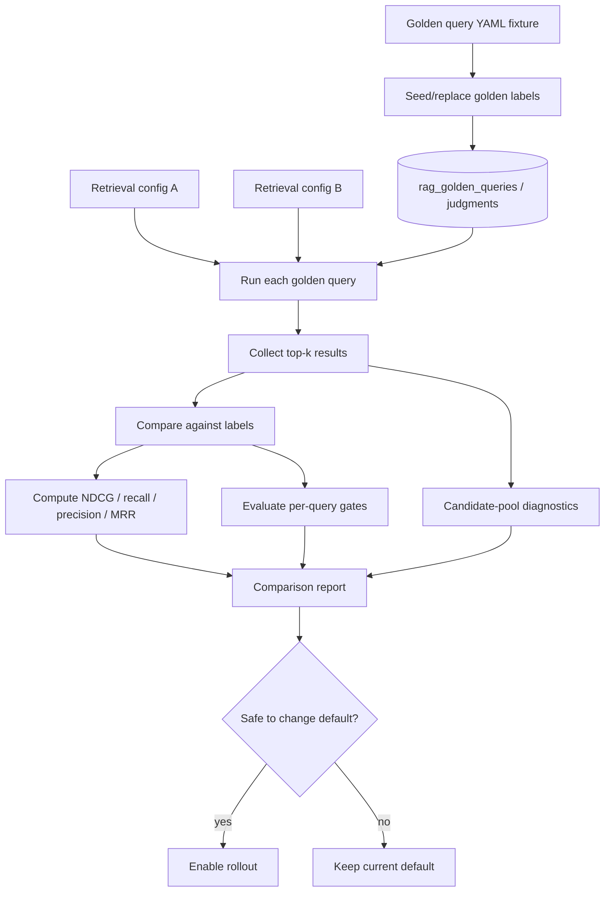

# RAG Evals Architecture

Evals are the part of AI Sage that measure whether retrieval changes actually improve answer quality.

In plain English: when we change parsing, chunking, retrieval, or reranking, evals rerun known questions and check whether the right evidence appears near the top.

## The Pieces

### Query Audit Trail

Every AI Sage retrieval can be recorded with the question, parsed plan, evidence returned, ranking metadata, and answer details. This lets us debug what happened later.

### Golden Query Fixture

A golden query is a known question we care about, such as a Munger mental-model question. The fixture lists the query and expected relevant chunks.

### Labeled Relevant Chunks

Labels say which chunks are relevant to a query and how important they are. These labels are curated eval data, not ingestion data.

### Offline Ranking Metrics

Metrics summarize whether relevant chunks appear near the top:

- **NDCG@k:** rewards highly relevant chunks near the top.
- **Recall@k:** measures how many known relevant chunks appeared in the top `k`.
- **Precision@k:** measures how many returned top-`k` chunks were relevant.
- **MRR:** measures how early the first relevant result appears.

### Config Comparison

The eval runner compares two retrieval configurations, for example hardening off vs hardening on, or heuristic ranking vs Jina reranking.

### Per-Query Rollout Gates

Aggregate metrics are not enough. A change can improve average quality while breaking an important query. Per-query gates protect specific known questions.

### Candidate-Pool Diagnostics

Candidate-pool diagnostics show whether relevant chunks entered the broad pool before ranking. If they did not, the reranker cannot rescue the query.

## End-To-End Eval Flow

## Example

Suppose we test Jina reranking.

1. Run baseline retrieval without Jina.
2. Run retrieval with Jina.
3. Compare aggregate metrics.
4. Check protected queries.
5. Inspect candidate-pool gaps.
6. Enable Jina only if it improves enough and passes per-query gates.

This matters because pure Jina can improve averages while hurting specific high-confidence queries. The current adaptive Jina behavior exists because evals exposed that tradeoff.

## What Gets Stored Or Reported

| Data | Purpose |
| --- | --- |
| `rag_queries` | query audit records |
| `rag_query_evidence` | returned evidence and ranking metadata |
| golden fixture YAML | versioned expected queries and labels |
| eval comparison report | metrics, deltas, gates, candidate-pool diagnostics |
| reranker diagnosis output | provider/input-mode comparison and rollout recommendation |

## Current State

Implemented:

- query and evidence audit records
- golden query fixtures under the API eval package
- seed/replace behavior for golden labels
- NDCG, recall, precision, and MRR
- retrieval config comparison
- per-query rollout gates
- reranker diagnosis across providers and input modes
- candidate-pool diagnostics

Still needs improvement:

- more labeled examples across authors and query styles
- UI/debug surface for eval reports
- fixture maintenance workflow as documents are re-ingested
- future LLM-assisted judging as a supplement, not replacement, for deterministic labels

## Technologies Used

| Step | Technology / Data |
| --- | --- |
| Golden fixture | YAML under API eval fixtures |
| Seeding | eval CLI seed command |
| Query execution | retrieval pipeline under selected config |
| Metrics | eval runner in backend |
| Reranker diagnosis | provider/input-mode eval harness |
| Rollout decision | aggregate thresholds plus per-query gates |

## Key Design Choices

1. **Labels are curated separately from ingestion.**
   Ingestion creates chunks. Evals label which chunks are good for specific queries.

2. **Per-query gates are required.**
   Average improvement does not justify breaking known important questions.

3. **Candidate-pool recall is measured.**
   If relevant evidence never enters the pool, the problem is retrieval recall, not reranking.

4. **Defaults require evidence.**
   Parser, retriever, and reranker defaults should change only after eval support.

## Alternatives Considered

- **Manual spot checks only:** useful for exploration but too anecdotal for rollout.
- **Aggregate metrics only:** hides individual regressions.
- **LLM-as-judge only:** useful later, but deterministic labels are more stable for gates.

## Why This Architecture

Evals make RAG engineering disciplined. They tell us whether quality improved, where it regressed, and whether the failure is ingestion, candidate recall, ranking, reranking, or answer generation.
