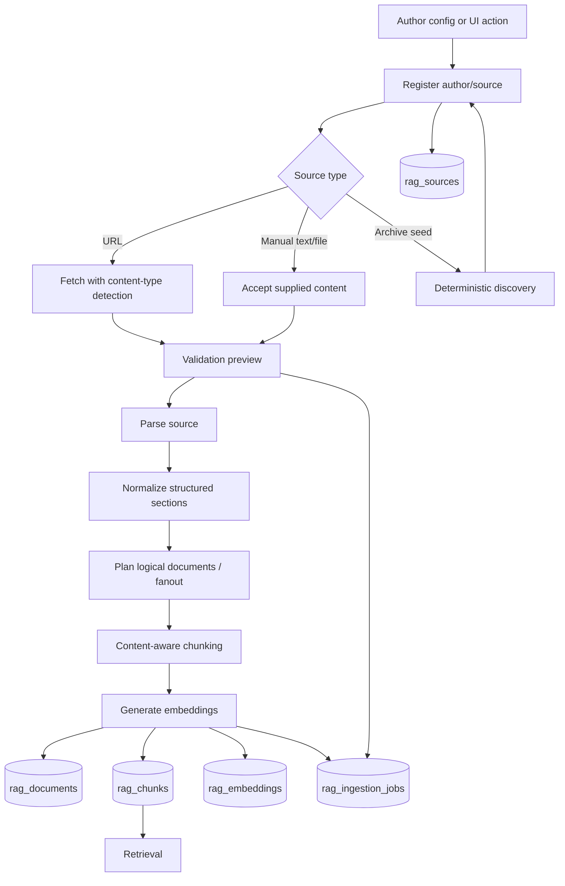

# RAG Ingestion Architecture

Ingestion is the part of AI Sage that takes external source material and turns it into searchable corpus data.

In plain English: a user gives CapitalOS an author/source URL or manual text. The system fetches it, parses it, splits it into useful chunks, embeds those chunks, and stores everything with enough metadata to retrieve and cite later.

## The Pieces

### Author And Source Registration

An author is a corpus owner such as Charlie Munger, Warren Buffett, Howard Marks, or another configured thinker/operator. A source is one URL or manual document attached to an author.

Sources are tracked so ingestion can be retried, audited, and refreshed without guessing what was previously imported.

### Source Discovery

Some authors have archive pages. Deterministic source discovery means the system can follow configured archive rules, find matching links, and register sources without broad crawling.

### Validation-First Source Planning

Before persistence, the system can preview what the source will become. This matters for compendiums or archive pages where one source may contain many logical documents.

### Parsing

Parsing converts raw source material into structured text. The parser should preserve headings, sections, tables, lists, captions, and source metadata when possible.

PDF parsing is unstructured-first with explicit fallback behavior. HTML/text/manual paths normalize into the same downstream pipeline.

### Logical Documents

A logical document is the user-meaningful work produced from a source. One source may produce one logical document, or a compendium may fan out into multiple logical documents.

### Chunking

Chunking splits a logical document into retrieval-sized passages. Good chunking keeps meaning together. It should avoid splitting tables, lists, figures, quotes, or section context in ways that make retrieval shallow.

### Embeddings

Embeddings turn chunks into vectors for dense semantic search. Production embeddings use provider-configurable external models; tests can use deterministic mock embeddings.

### Metadata And Lineage

Every chunk should carry enough metadata to explain where it came from: author, source URL, document title, section path, chunk index, parser path, source type, and embedding model.

## End-To-End Ingestion Flow

## What Gets Stored

| Data | Purpose |
| --- | --- |
| `rag_sources` | source URL/manual source, author, source type, ingestion status |
| `rag_documents` | logical document metadata and normalized text |
| `rag_chunks` | retrieval-sized passages plus metadata |
| `rag_embeddings` | vector representation for dense search |
| `rag_ingestion_jobs` | run status, errors, stats, parser path, audit trail |

## Current Product Decision

Author Library is intentionally simple right now: authors and external source links. We are not building a full internal reader as the primary product surface.

That means ingestion still needs good metadata and chunks for AI Sage, but it does not need to preserve full-document rendering as a standalone reader product.

## Current State

Implemented:

- config-driven author sync
- source registration and discovery
- validation preview for selective ingestion and fanout
- HTML/PDF/text/manual parsing paths
- PDF parser policy with unstructured-first behavior
- chunk metadata for modality, headings, section paths, captions, and source references
- ingestion job status and failure categories
- embeddings with provider configuration and deterministic test mode

Still needs improvement:

- more robust parsing for hard PDFs
- better OCR/scanned-document handling
- stronger figure/table preservation where those elements carry meaning
- safer re-ingestion and corpus replacement workflows
- more automated corpus-quality diagnostics after ingestion

## Technologies Used

| Step | Technology / Data |
| --- | --- |
| Source registry | Postgres `rag_sources` |
| Fetching | HTTP fetchers with content-type/source-type detection |
| PDF parsing | Unstructured first, explicit fallback path |
| HTML parsing | DOM/text normalization path |
| Chunking | content-aware chunker in the ingestion pipeline |
| Embeddings | provider-configurable embedding layer, deterministic mock mode for tests |
| Storage | Postgres + pgvector |
| Audit | `rag_ingestion_jobs`, source/document/chunk metadata |

## Key Design Choices

1. **Validate before writing corpus data.**
   Previewing parse/fanout behavior prevents bad source planning from polluting the corpus.

2. **Preserve structure when possible.**
   Retrieval is better when headings, tables, section paths, and captions survive ingestion.

3. **Chunk for meaning, not just size.**
   A chunk should usually be understandable as evidence. Tiny fragments and overlarge mixed-topic chunks both hurt retrieval.

4. **Keep lineage everywhere.**
   Evidence must trace back to author, document, chunk, and source URL.

5. **Do not overbuild the reader.**
   Since Author Library now links externally, ingestion should optimize for retrieval and citation quality.

## Alternatives Considered

- **Plain text extraction only:** easiest, but loses structure and produces weak retrieval.
- **LLM parser for every document:** flexible, but expensive and harder to reproduce.
- **Internal full-document reader as the main surface:** deferred because external source URLs are enough for now.

## Why This Architecture

Good retrieval starts before retrieval. This architecture gives AI Sage clean, traceable, retrieval-ready chunks without turning ingestion into a broad web crawler or full reader product.
