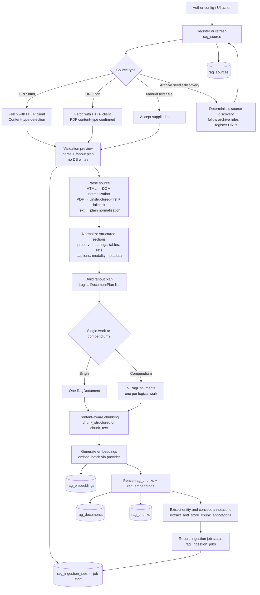

# RAG Ingestion Architecture

Ingestion is the stage that takes external author source material and converts it into searchable, retrieval-ready corpus data. Everything downstream — candidate generation, ranking, evidence quality, and answer grounding — depends on what ingestion produces.

This document is the current source of truth for the AI Sage ingestion architecture. For the full pipeline, see [AI Sage Product Architecture](./ai-sage-product-architecture.md).

---

## Glossary

| Term | Definition |
|---|---|
| **Author** | A named corpus owner (e.g. Warren Buffett, Charlie Munger) whose source material is ingested |
| **Source** | One URL or manually supplied document attached to an author, stored in `rag_sources` |
| **Source type** | The format of a source: `html`, `pdf`, `text`, or `manual` |
| **Logical document** | One user-meaningful work produced from a source — a letter, essay, speech, or book chapter |
| **Fanout** | Splitting one source into multiple logical documents (e.g. a compendium containing 20 letters) |
| **Chunk** | A retrieval-sized text passage (~400 tokens) produced from a logical document, stored in `rag_chunks` |
| **Parent chunk** | A larger containing passage that contextualizes a chunk; used for display-only context expansion, not as ranked evidence |
| **Neighboring chunk** | An adjacent chunk from the same document, ±2 index positions; assembled for display context only |
| **Section path** | A hierarchical list of heading names tracing from the document root to the current section (e.g. `["Annual Letter 2006", "Scale Economies Shared"]`) |
| **Modality** | The content type of a section or chunk: `text`, `table`, `list`, `figure`, `caption` |
| **Embedding** | A vector representation of a chunk used for dense semantic search via pgvector |
| **Ingestion job** | A tracked run of the ingestion pipeline for one source, stored in `rag_ingestion_jobs` |
| **Fanout plan** | The output of the plan step that decides how many logical documents to produce from one source |
| **Validation preview** | Running parse and fanout without writing corpus data, to inspect what a source will produce |
| **Selective ingestion** | Choosing a subset of the fanout plan documents to actually ingest |
| **Lineage** | The chain of metadata that traces a chunk back to its chunk index, document, source URL, and author |

---

## Why Ingestion Quality Matters

Retrieval can only find evidence that ingestion produced. Ingestion failures and quality degradation propagate forward:

- **Splitting tables mid-row** produces truncated evidence that is hard to interpret and often irrelevant in search results.
- **Losing section headings** removes structural context that the chunker uses to keep related content together.
- **Over-fragmenting text** creates tiny chunks that retrieve well but contain too little context to ground an answer.
- **Including boilerplate** (navigation, footers, disclaimers) pollutes the candidate pool with noise.
- **Missing fanout** means the retrieval system treats a 200-page compendium as a single work, producing chunks whose chunk_index alone cannot identify which letter they came from.

Good ingestion is a prerequisite for good retrieval, not an optional optimization.

---

## End-To-End Ingestion Flow



---

## Stage-By-Stage Detail

### Author and Source Registration

An author is a corpus owner configured in the system (e.g. `warren_buffett`, `charlie_munger`). A source is one URL or manual text block attached to an author and stored in `rag_sources` with:

- `url` — the external URL (or null for manual sources)
- `source_type` — detected or supplied: `html`, `pdf`, `text`, `manual`
- `author_id` — foreign key to the author
- `ingestion_status` — current state: `pending`, `in_progress`, `completed`, `failed`
- `metadata_json` — source-level metadata including any preset configuration

Some authors have archive or listing pages. Deterministic source discovery follows configured rules to find and register individual source URLs from those pages, without broad crawling.

### Fetching and Content-Type Detection

For URL-based sources, the HTTP client fetches the URL. The response content-type (and optionally a file extension hint) determines the source type. The fetcher returns a `FetchResult` with raw bytes and detected content type.

Failure modes at this stage:
- `network_error` — timeout, DNS failure, HTTP error status
- `ocr_required` — PDF contains only scanned images with no extractable text

### Validation Preview

Before writing any corpus data, the pipeline can run a preview that parses the source and builds the fanout plan without persisting documents or chunks. This lets an operator:

- verify how many logical documents will be produced
- inspect the title and section structure of each planned document
- decide which documents to include or exclude (selective ingestion)
- catch parser failures before polluting the corpus

### Parsing

The parser converts raw bytes into a `ParseResult` containing a list of `DocumentSection` objects. Parser selection by source type:

**HTML parser**: DOM normalization extracts the main content, headings (h1–h6), paragraphs, tables, and lists. Navigation, footers, and sidebars are filtered. Section nesting is preserved as `section_path` metadata.

**PDF parser**: Unstructured-first policy. The system first attempts to parse with the `unstructured` library, which handles layout-aware extraction, table detection, and heading detection. If `unstructured` is not available or returns empty text, the fallback path activates. Parser metadata records `pdf_parser_backend_used`, `pdf_parser_fallback_used`, `pdf_parser_fallback_from`, and `pdf_parser_fallback_reason` in the document metadata.

**Text / Manual parser**: Plain normalization splits on paragraph boundaries and preserves any explicit heading hints.

### Normalization and Structure Preservation

After parsing, `normalize_with_ingestion_config()` and `apply_source_preset()` apply source-specific normalization rules. This step:

- strips repeated boilerplate sections (e.g. standard disclaimers, headers common to all pages in an archive)
- normalizes whitespace and encoding
- applies section-title overrides when the raw source uses non-standard heading formats
- preserves tables, lists, captions, and modality labels

Each `DocumentSection` carries:
- `heading` — section heading text
- `level` — heading depth
- `content_type` — `text`, `table`, `list`, `figure`, `caption`
- `content` — text content (tables use Markdown format via `table_markdown`)
- `caption` — figure or table caption when present
- `metadata.section_path` — list of ancestor heading names
- `metadata.modality` — content modality for retrieval-time filtering
- `metadata.source_ref` — inline citation or footnote reference when present

### Logical Document Fanout

`build_fanout_plan()` takes the parsed sections and builds a `FanoutPlan` — a list of `LogicalDocumentPlan` objects. Each plan describes one logical document: its title, author, publication date, venue, collection, source section, and which parsed sections belong to it.

**Example**: A Buffett compendium PDF containing 60 shareholder letters fans out into 60 `LogicalDocumentPlan` objects, one per letter, each with its own title (`"1996 Shareholder Letter"`), year, and subset of sections.

Each logical document plan is validated for quality before its chunks are persisted. Low-quality plans (empty text, suspicious character ratios, extraction failures) are rejected with a `FAILURE_LOW_QUALITY_EXTRACTION` status rather than stored.

### Content-Aware Chunking

Each logical document's sections are chunked using either:

- `chunk_structured(sections)` — for documents with rich section structure (uses section boundaries as preferred split points)
- `chunk_text(text)` — for documents where sections are unavailable or very short

Target chunk size: approximately 400 tokens per chunk. The chunker:

- keeps tables whole when they fit within the token budget
- keeps list items together
- attaches captions to their parent content block
- overlaps adjacent chunks by a configurable token count to reduce split-boundary retrieval gaps

Each `Chunk` carries a `metadata_json` dict with:

```
{
  "author": "Warren Buffett",
  "author_id": "warren_buffett",
  "work_title": "1996 Annual Shareholder Letter",
  "source_url": "https://berkshirehathaway.com/letters/1996.html",
  "source_type": "html",
  "section_path": ["1996 Annual Shareholder Letter", "The Economics of Our Businesses"],
  "heading": "The Economics of Our Businesses",
  "modality": "text",
  "year": 1996,
  "doc_hash": "sha256...",
  "content_type": "text"
}
```

### Embedding Generation

`embed_batch(texts)` converts the list of chunk texts into a list of embedding vectors using the configured embedding provider. The provider is isolated behind the `embedder.py` interface so it can be swapped without changing the pipeline.

In test mode, a deterministic mock embedder returns fixed-length vectors for reproducible test runs. In production, an external model API is called.

The model name is recorded on each `RagEmbedding` row so changes to the embedding model are auditable and future re-indexing is scoped correctly.

### Storage Tables and Lineage

| Table | Purpose |
|---|---|
| `rag_sources` | Source URL, author, source type, ingestion status |
| `rag_documents` | Logical document metadata — title, author, publication date, venue, collection, source section |
| `rag_chunks` | Retrieval-sized passages with chunk index and metadata |
| `rag_embeddings` | pgvector embedding for each chunk with model name |
| `rag_ingestion_jobs` | Per-job run status, error details, stats, parser path, and audit trail |

Every chunk carries enough metadata to trace lineage: author → source URL → document title → section path → chunk index. This lineage is the evidence card in the UI.

### Entity and Concept Annotations

After chunks are persisted, `extract_and_store_chunk_annotations()` scans each chunk for known entity and concept names using alias pattern matching. Matches are stored in the chunk's `metadata_json` as `annotated_entity_ids` and `annotated_concept_ids`.

These annotations are used by the retrieval system's entity/concept candidate pools and (optionally) prepended to reranker input text when `RAG_RERANKER_ENTITY_CONTEXT=1`.

### Ingestion Job Status and Failure Categories

Each ingestion run produces a `rag_ingestion_jobs` record with status and, on failure, a failure category:

| Failure category | Meaning |
|---|---|
| `network_error` | Fetch failed (timeout, HTTP error, DNS failure) |
| `parse_failed` | Parser raised an exception on the raw content |
| `empty_text_extraction` | Parse succeeded but produced no usable text |
| `ocr_required` | PDF is image-only; no text layer present |
| `manual_review_required` | Content structure requires human decision |
| `no_content_selected` | Selective ingestion options removed all content |
| `low_quality_extraction` | Extracted text failed quality validation |

---

## Concrete Example

**Source**: Nick Sleep's Nomad Letters, a PDF compendium containing annual letters from 2001–2014.

1. **Registration**: source URL registered with `source_type=pdf`, `author_id=nick_sleep`.
2. **Fetch**: HTTP client downloads the PDF. Content-type confirmed as `application/pdf`.
3. **Parse**: Unstructured-first PDF parser extracts structured sections. Each section has a heading (`"Annual Letter — December 2006"`), content type (`text` or `table`), and modality metadata.
4. **Fanout**: The fanout planner identifies 14 distinct letters. It builds 14 `LogicalDocumentPlan` objects, one per year.
5. **Chunking**: The 2006 letter is chunked into ~35 passages of ~400 tokens each. Chunk 13 contains the opening of the "scale economies shared" discussion. Chunk 14 continues it. Chunk 15 contains the Amazon example.
6. **Embeddings**: All 35 chunks are embedded in one batch call. Vectors stored in `rag_embeddings`.
7. **Lineage**: Chunk 14 carries `author_id=nick_sleep`, `source_url=...Full_Collection_Nomad_Letters...`, `document_title="Nomad Investment Partnership Annual Letter — December 2006"`, `chunk_index=14`.
8. **Golden eval**: The fixture entry `doc_external_id: "Full_Collection_Nomad_Letters"`, `document_title: "...December 2006"`, `chunk_index: 14`, `relevance: 3` resolves to this exact chunk at seed time.

---

## Implemented vs Deferred

**Implemented:**

- Config-driven author sync and source registration
- Source discovery for archive pages
- Validation preview for selective ingestion and fanout inspection
- HTML, PDF, text, and manual parsing paths
- PDF parser policy with Unstructured-first behavior and fallback tracking
- Chunk metadata for modality, headings, section paths, captions, and source references
- Ingestion job status tracking and failure categories
- Embeddings with provider isolation and deterministic test mode
- Entity and concept annotation extraction

**Still needs improvement:**

- More robust parsing for hard PDFs (complex layout, multi-column, scanned pages)
- Better OCR and scanned-document handling
- Stronger figure and table preservation where those elements carry the primary meaning
- Safer corpus replacement workflow for re-ingesting updated source material
- Automated corpus-quality diagnostics post-ingestion

---

## Key Design Choices

1. **Validate before writing corpus data.** Previewing parse and fanout behavior prevents bad source planning from polluting the corpus and forces explicit decisions about what to include.

2. **Preserve structure when possible.** Headings, tables, section paths, and captions survive ingestion. Retrieval quality is directly proportional to how much structure chunks retain.

3. **Chunk for meaning, not just size.** A chunk should usually be understandable as self-contained evidence. Tiny fragments and overlarge mixed-topic chunks both hurt retrieval.

4. **Keep lineage everywhere.** Evidence must trace back to author, document, chunk index, and source URL. The chunk_index within a document is the stable identifier used by the golden eval fixture.

5. **Fanout is a first-class concern.** A compendium that is not fanned out correctly produces undifferentiated chunks that the retrieval system cannot distinguish by logical document.

6. **Do not overbuild the reader surface.** Ingestion optimizes for retrieval and citation quality. Full document rendering in the product is deferred.

---

## Technologies Used

| Step | Technology |
|---|---|
| Source registry | Postgres `rag_sources` |
| Fetching | HTTP client with content-type detection |
| PDF parsing | Unstructured-first, explicit fallback path |
| HTML parsing | DOM normalization |
| Chunking | Content-aware chunker, tiktoken token counting, optional spaCy sentencizer |
| Embeddings | Provider-isolated embedding layer; deterministic mock for tests |
| Storage | Postgres + pgvector |
| Audit | `rag_ingestion_jobs`, per-chunk metadata |
