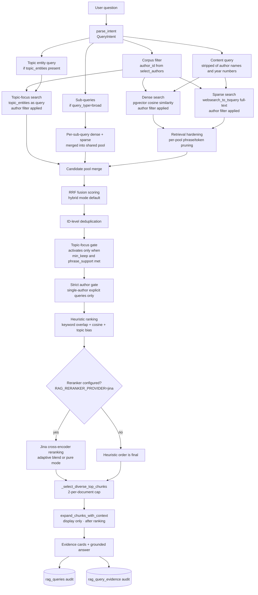

# RAG Retrieval Architecture

Retrieval is the stage of the AI Sage pipeline that takes a user question, searches the ingested author corpus, and returns the passages that ground the answer.

This document describes each stage of the production retrieval path in order. Every technical term is defined before it is relied upon.

For the full pipeline context, see [AI Sage Product Architecture](./ai-sage-product-architecture.md). For how retrieval quality is measured, see [Evaluation Architecture](./evals.md).

---

## Glossary

| Term | Definition |
|---|---|
| **Query intent** | The structured interpretation of a user query: author constraints, topic entities, date range, query type, and sub-queries |
| **Author constraint** | An `author_id` filter that restricts retrieval to one author's corpus |
| **Topic entity** | A concept or entity phrase extracted from the content part of a query (e.g. `"scale economies shared"`, `"margin of safety"`) |
| **Dense retrieval** | pgvector cosine similarity search over stored chunk embeddings |
| **Sparse retrieval** | Postgres full-text search using `websearch_to_tsquery` on chunk text |
| **Candidate pool** | A named temporary list of chunks from one retrieval pass (e.g. dense pool, sparse pool, topic-focus pool) |
| **Broad pool** | The merged set of all candidate pools before ranking (24–60 chunks by default) |
| **RRF** | Reciprocal Rank Fusion — a method to combine multiple ranked lists without normalizing scores: `score(d) = Σ 1 / (k + rank(d))` where k=60 |
| **Retrieval hardening** | Pre-fusion per-pool pruning that removes chunks with zero phrase or token overlap against the retrieval query plan |
| **Heuristic ranking** | Ranking based on lexical keyword overlap + topic entity hits + cosine similarity |
| **Cross-encoder reranker** | A model that sees query and passage together and produces a relevance score; more accurate than embedding distance alone |
| **Adaptive blend** | Mixing heuristic rank and cross-encoder score using a tunable alpha (default 0.45) |
| **Pure rerank** | Using cross-encoder score alone, no heuristic blend |
| **Topic-focus gate** | A post-deduplication filter that removes candidates with zero topic entity matches, active only when phrase support is sufficient |
| **Diversity cap** | A per-document limit (default 2 chunks per document) in the final selection step |
| **Expanded context** | Neighboring chunks fetched after ranking for display only; they do not re-enter the candidate pool |
| **Anchor chunk** | The chunk selected as ranked evidence; the basis for expanded context |
| **Source author terms** | Tokens derived from author names/IDs, stripped from the keyword query to prevent false AND-conjunction matches |
| **Sub-query** | One decomposed sub-question from a broad comparison query |

---

## End-To-End Query Flow



---

## Stage-By-Stage Detail

### Stage 1 — Query Intent Parsing

`parse_intent(query)` converts the raw user question into a `QueryIntent`:

```python
@dataclass
class QueryIntent:
    query_type: str            # single_author | multi_author | broad | company
    author_ids: list[str]      # e.g. ["warren_buffett"]
    author_names: list[str]    # e.g. ["Warren Buffett"]
    source_types: list[str]    # e.g. ["pdf", "html"] — optional hint
    date_from: Optional[str]   # e.g. "1996"
    date_to: Optional[str]     # e.g. "2000"
    topic_entities: list[str]  # e.g. ["circle of competence"]
    sub_queries: list[str]     # decomposed questions for broad queries
```

The parser first attempts the cheap routing LLM (`ROUTING_LLM_MODEL`); if unavailable or on failure, it falls back to a pure-Python text parser that uses pattern matching against `_KNOWN_AUTHORS`, date regexes, and output shape keywords.

That hybrid approach is deliberate. A cheap routing LLM is useful because it can recognize paraphrased query shapes and broad-comparison intent more flexibly than rigid patterns. The pure-Python fallback remains essential because query routing must still work in degraded environments and because some intent fields, such as author IDs and date ranges, need deterministic extraction when the model path is unavailable.

**Critical design rule:** Author names detected in the query become `author_id` corpus filters, not relevance terms. The text `"What does Munger say about inversion?"` sets `author_ids=["charlie_munger"]` and `topic_entities=["inversion"]`. The keyword query sent to sparse search will not contain the word "Munger."

### Stage 2 — Author and Corpus Constraints

`select_authors()` picks which authors' corpora to search:

- **`single_author` query with detected author**: pin to that author only, `top_k=1`.
- **All other query types**: score all known authors against the query, return top-k most relevant.

The selected author IDs become SQL `WHERE author_id = ?` filters on every dense and sparse retrieval call. This is the only hard corpus constraint in the retrieval path. Source type is not used as a hard filter.

This is implemented as a database-level filter, not as a post-processing preference, because candidate recall should be scoped before vector search or full-text search runs. The system intentionally does not use source type as another hard filter: that would be easy to add in SQL, but it would narrow the candidate pool too early and hurt recall more often than it helps precision.

### Stage 3 — Content Query and Topic Entity Query Building

Two queries are built from the intent:

**Content query** (for dense and sparse search):
`_clean_query_for_keyword_search()` strips source-author name tokens and detected year numbers from the original query, then calls `build_retrieval_query_plan()` to extract the semantic core. This becomes the actual search string for both dense embedding and sparse `tsquery`.

This separation exists because dense and sparse retrieval have different failure modes. Dense search is tolerant of paraphrase but can drift semantically; sparse search is precise on exact terms but brittle if noisy tokens stay in the query. Stripping author-name terms and year numbers before query construction reduces false conjunction pressure in Postgres full-text search and removes low-signal lexical clutter from the embedding query.

**Topic entity query**: when `topic_entities` are non-empty (e.g. `["scale economies shared"]`), a separate query string is built from those entity terms alone. This runs as an independent retrieval pass to ensure the named concept gets strong representation in the pool.

### Stage 4 — Candidate Pool Assembly

The broad pool is assembled from up to four sources:

#### Dense Pool
pgvector cosine similarity search over `rag_embeddings`. The content query is embedded at runtime and compared against all chunk embeddings passing the author filter. Returns chunks ordered by cosine distance ascending.

`_DENSE_TOP_K_MULTIPLIER = 3` multiplies the requested top-k before querying to provide more candidates for RRF.

The implementation uses Postgres + pgvector rather than a separate vector database so dense retrieval sits beside the chunk, document, and audit metadata it already depends on. That keeps retrieval more operationally compact and makes author filtering, diagnostics, and later joins simpler. The tradeoff is that a dedicated vector store might offer more specialized ANN tuning at large scale, but the current corpus benefits more from integration and auditability than from introducing another storage system.

#### Sparse Pool
Postgres full-text search using `websearch_to_tsquery`. Operates on the `chunk_text_tsv` tsvector column (or equivalent). Returns chunks ordered by `ts_rank` descending.

Sparse search is good at:
- exact phrase matching (`"mental models"`, `"scale economies shared"`)
- entity names (tickers, person names)
- transcript language where speakers use specific terminology

Sparse search is not used as a hard AND-conjunction gate. Author names are removed from the query before this step precisely because requiring both `"Munger" AND "mental models"` in the same chunk text would fail for chunks that correctly discuss mental models without repeating the author's name.

`websearch_to_tsquery` is chosen over a more manual tsquery builder because it handles natural query text more safely and predictably while still using native Postgres full-text indexes. A dedicated search engine like Elasticsearch could support richer analyzers, but it would also duplicate corpus state and complicate the audit trail for a retrieval system that already lives in Postgres.

#### Topic-Focus Pool
When `topic_entities` are non-empty, `_retrieve_with_intent_fallback()` runs a separate pass using the topic entity string as the query. This pool contributes chunks that contain the named concept even if they do not match the broader content query.

This is a separate retrieval pass rather than a bonus term inside one global score because entity-heavy questions often fail asymmetrically: the broad content query retrieves semantically related material while exact concept mentions get diluted. The independent pool gives those mentions explicit representation before fusion.

#### Sub-Query Pools
When `intent.sub_queries` is non-empty (broad comparison queries like "compare Buffett and Munger on patience"), each sub-question runs its own dense+sparse pass with `per_sub_k = max(8, broad_top_k // len(sub_queries))`. Results are accumulated into the shared pool.

#### Pool Size Targets
| Config | Default | Meaning |
|---|---|---|
| `_BROAD_RETRIEVAL_MIN` | 24 | Minimum broad pool target |
| `_BROAD_RETRIEVAL_MAX` | 60 | Maximum broad pool target |
| `_BROAD_RETRIEVAL_MULTIPLIER` | 4 | `top_k_chunks × multiplier` for pool size |
| `_BROAD_RETRIEVAL_MIN_PER_SUB_QUERY` | 8 | Minimum per sub-query pool contribution |

### Stage 5 — Retrieval Hardening

When `RAG_RETRIEVAL_HARDENING=1` (enabled by default), `_prune_retrieval_pool()` runs on each pool independently before RRF fusion. It uses the `RetrievalQueryPlan` — which includes `required_phrases`, `concept_terms`, and `content_query` — to remove chunks with zero phrase overlap and zero token overlap against the query plan. Chunks that pass neither criterion are pruned.

This prevents clearly off-topic chunks from entering the merged pool. The prune step runs **before** RRF, so it affects the quality of what RRF sees.

This is implemented as deterministic lexical and phrase pruning rather than another model call because it sits on the critical path of every retrieval. A model-based hardening stage could be more nuanced, but it would add latency, cost, and another source of nondeterminism before ranking even begins.

### Stage 6 — RRF Fusion and Deduplication

`reciprocal_rank_fusion()` merges all pools using RRF:

$$\text{score}(d) = \sum_{\text{pool}} \frac{1}{k + \text{rank}_{\text{pool}}(d)}$$

where k = 60 (configurable via `RAG_RETRIEVAL_RRF_K`). A chunk that appears in rank 5 in the dense pool, rank 3 in the sparse pool, and rank 2 in the topic pool accumulates score from all three. A chunk that appears in only one pool gets a smaller combined score.

RRF is used because it combines heterogeneous rank lists without pretending their native scores are comparable. That matters here because cosine distance, `ts_rank`, and topic-focus retrieval signals are not calibrated to one another. A learned score normalizer could exist, but RRF is deterministic, robust, and easier to diagnose when one pool starts dominating.

**ID-level deduplication** then removes duplicate chunk entries so the same chunk_id cannot appear twice in the merged pool regardless of how many pools found it.

The merged pool is then sorted:
- When `topic_entities` are present: `_topic_candidate_pool_sort_key()` sorts by (−phrase_hits, −token_hits, −retrieval_score)
- When `hybrid` mode with no topic entities: sort by RRF score descending
- Otherwise: sort by cosine_distance ascending

The sorted pool is truncated to `broad_top_k`.

### Stage 7 — Topic-Focus Gate and Author Gate

**Topic-focus gate** (runs on the merged pool after RRF):

For each chunk in the pool, `_chunk_matches_topic_focus()` checks:
1. Phrase hits or token hits in chunk text (and expanded context if already available)
2. Any required_phrases from the retrieval query plan appear in the text
3. Any `resolved_entity_ids` match the chunk's `annotated_entity_ids`

Chunks that fail all three checks are candidates for removal. The gate **activates only when both conditions hold**:
1. At least `max(6, min(broad_top_k, 10))` chunks survive the filter
2. At least 2 chunks in the pool have at least one exact topic phrase (`_topic_focus_phrase_support_count >= 2`)

When either condition fails, the full pool proceeds unchanged. This prevents the gate from starving the reranker when the corpus has thin coverage of the topic entity.

**Strict author gate** (for single-author explicit queries):

When `strict_source_author=True` (meaning the query explicitly names the author, e.g. "What does Buffett say about…") and `author_ids` are set, `_filter_chunks_to_author_ids()` removes any chunk from the merged pool whose `metadata_json.author_id` is not in the allowed set. This guard runs after all pools are merged to catch cross-author leakage.

### Stage 8 — Heuristic Ranking

`_heuristic_rank_candidates()` scores each candidate:

1. **Lexical keyword overlap**: count of query keyword tokens (length ≥ 3, not stopwords) present in the chunk text.
2. **Topic entity phrase hits**: bonus for each exact entity phrase present (+200 base + 80 per additional phrase).
3. **Topic entity token hits**: smaller bonus for individual entity tokens.
4. **Negative topic bias**: −120 if topic entities are present but the chunk has zero hits.
5. **Cosine similarity**: `1.0 − cosine_distance` from the dense retrieval score.
6. **Metadata weighting** (optional, `RAG_METADATA_WEIGHTING_ENABLED`): a per-corpus-class multiplier on the base score.

Chunks are then sorted by the composite score descending. This heuristic order is the fallback and the baseline when no cross-encoder reranker is configured.

The heuristic layer exists because it is cheap, explainable, and stable. It gives a useful ranking even when no reranker is configured and provides an interpretable baseline against which reranker changes can be measured. A purely neural ranking stack would be simpler on paper, but it would remove the transparent intermediate signal that the eval and diagnosis tooling currently relies on.

### Stage 9 — Cross-Encoder Reranking

When `RAG_RERANKER_PROVIDER=jina` and `JINA_API_KEY` is set, `reranker_available()` returns True and the pipeline calls the Jina Reranker REST API.

**What the cross-encoder sees**: the full `(query, passage)` pair scored together. The cross-encoder is a transformer model that reads both query and passage in the same forward pass, making it significantly more accurate than comparing independent embeddings.

**Input mode** controls the passage text sent to the reranker:

| Mode | Content | Max chars |
|---|---|---|
| `raw` | Anchor chunk text only | unlimited |
| `compact_context` | Document title + section heading + anchor text | 900 chars |
| `expanded_context` | Full neighboring context text | unlimited |

Input mode is controlled by `RAG_RERANKER_INPUT_MODE` (default: `raw`).

When `RAG_RERANKER_ENTITY_CONTEXT=1`, entity and concept annotation labels are prepended to the passage text before the reranker call.

**Adaptive fusion** controls how the reranker score blends with the heuristic score:

```
blend_alpha = RAG_RERANKER_BLEND_ALPHA  (default 0.45, clamped 0.0–0.80)
```

| `fusion_mode` | When | Final order |
|---|---|---|
| `pure` | `_query_allows_aggressive_rerank()` → True, **or** `_query_prefers_author_attribution_pure_rerank()` → True | Sorted by reranker score alone |
| `conditional_blend` | All other queries | `(1 − alpha) × normalized_heuristic_rank + alpha × reranker_score` |

`_query_allows_aggressive_rerank()` returns True for broad list queries: "what are the main…", "list the key…", "summarize…".

`_query_prefers_author_attribution_pure_rerank()` returns True when all of these hold:
- The query has explicit attribution shape ("what does X say about Y")
- topic_entities and source_author_terms are both non-empty
- The candidate pool has ≥ 8 chunks
- At least 2 chunks contain an exact topic phrase (phrase support count ≥ 2)

If the Jina API call fails, the pipeline logs a warning and falls back to the heuristic-ranked order without surfacing the failure to the user.

The fusion mode is recorded in each chunk's `metadata_json.retrieval_diagnostics.reranker_fusion` for later inspection.

The reranker is provider-swappable on purpose. Jina is the current default because it improves query-passage matching enough to justify the extra network call in the current corpus, but it is isolated behind a provider interface so the system can fall back to heuristic ranking or compare alternatives without rewriting the retrieval pipeline. That separation is important because rerankers are one of the most volatile components in this stack.

### Stage 10 — Final Evidence Selection

`_select_diverse_top_chunks()` applies a per-document cap (default: 2 chunks per document, `_RERANK_PER_DOCUMENT_CAP`):

1. Walk the ranked list; for each chunk, check how many chunks from the same document have already been selected.
2. If count < cap, add the chunk to `selected`.
3. If count ≥ cap, move the chunk to `overflow`.
4. After the main pass, fill remaining slots from overflow if `len(selected) < top_k`.

Selected chunks are sorted by `ranking_sort_key`: reranker score first (when available), then weighted score, then raw cosine distance.

### Stage 11 — Why Parent and Neighboring Chunks Must Not Compete

Parent chunks and neighboring chunks are fetched in Stage 12 for UI display only. They are explicitly excluded from the ranked evidence pool for two reasons:

1. **Double-counting relevance**: a parent chunk contains the text of its child anchor chunks verbatim. Ranking it separately would give the same content two evidence slots.
2. **Deduplication interference**: comparing expanded contexts during deduplication would cause `suppress_near_duplicates()` to suppress genuinely distinct adjacent chunks whose expanded windows overlap.

The production code deduplicates on anchor chunk texts only, **before** context expansion. Expanded context is attached after deduplication as display-only metadata.

### Stage 12 — Expanded Context Attachment (Display Only)

After ranking and deduplication are complete, `expand_chunks_with_context()` queries `rag_chunks` for neighboring chunks (±`_CONTEXT_EXPANSION_WINDOW = 2` indices, max `_CONTEXT_EXPANSION_MAX_CHARS = 1800` characters).

The neighboring text is attached to each anchor chunk's `metadata_json` as `context_text`. The UI shows this when the user expands an evidence card to see the surrounding passage.

This is implemented as a direct neighbor query on `rag_chunks`, not as a second retrieval pass, because the goal is display context rather than new evidence selection. Keeping this as a cheap local lookup preserves ranking determinism and avoids reintroducing context blobs into the competition set.

This step has no effect on which chunks were selected or their order. It is purely a display enhancement.

### Stage 13 — Audit Output

Every `execute_concept_query()` call writes to:

- `rag_queries`: query text, parsed intent, selected authors, latency, retrieval configuration.
- `rag_query_evidence`: each evidence chunk's ID, scores (cosine distance, RRF score, ts_rank, reranker score, blend mode).

Stage-level trace events are emitted throughout the pipeline via `trace_retrieval_payload()` and `trace_retrieval_chunks()` when `RAG_RETRIEVAL_TRACE=1`. The `diagnose-query` CLI command captures this trace to a file:

```bash
docker compose exec api python -m app.rag.eval.cli diagnose-query \
  --query "what does Nick Sleep think about Amazon?" \
  --top-k 10 \
  --output /app/data/nick_amazon_debug.txt
```

The trace shows every pool transition, gate decision, and reranking step for post-hoc inspection.

The audit layer lives in Postgres tables plus optional trace files because the system needs durable, queryable records for regression diagnosis. Log-only tracing would be easier to ship initially, but it is much harder to compare ranked evidence, pool composition, and reranker decisions across experiments if that data is not structured.

---

## Concrete Walkthrough

**Query:** "What does Nick Sleep say about scale economies shared?"

**Step 1 — Intent:**
```
query_type: single_author
author_ids: ["nick_sleep"]
author_names: ["Nick Sleep"]
topic_entities: ["scale economies shared"]
```

**Step 2 — Author constraint:** `select_authors()` pins to `nick_sleep`. All retrieval calls filter to `author_id = nick_sleep`.

**Step 3 — Content query:** `_clean_query_for_keyword_search()` strips "Nick Sleep" → cleaned query: `"scale economies shared"`. This is also the topic entity query since topic_entities are present.

**Step 4 — Candidate pool:**
- Dense: pgvector returns ~36 chunks from Nick Sleep's corpus ordered by embedding distance to "scale economies shared".
- Sparse: full-text search for `'scale' & 'economies' & 'shared'` returns chunks with exact phrase matches.
- Topic-focus: another dense+sparse pass using `"scale economies shared"` directly.

**Step 5 — Retrieval hardening:** Chunks from dense and sparse pools with zero phrase/token overlap against the retrieval plan are pruned before RRF.

**Step 6 — RRF:** Pools merged. Chunks 13, 14, 15 from the December 2006 Nomad letter score highly because they appear in both dense and sparse pools at high ranks.

**Step 7 — Topic-focus gate:** `topic_entities = ["scale economies shared"]`. Most chunks from Nick Sleep's corpus that discuss this concept pass. The gate has phrase support from multiple chunks and keeps the focused pool.

**Step 8 — Heuristic ranking:** Chunks with "scale economies shared" as an exact phrase get +200 entity phrase bonus on top of their cosine similarity score.

**Step 9 — Reranking (if Jina enabled):** The cross-encoder scores each `(query, passage)` pair. For the attribution-shaped query ("what does Nick Sleep say about…") with sufficient phrase support, `_query_prefers_author_attribution_pure_rerank()` returns True → `pure` mode → reranker score alone determines order.

**Step 10 — Diversity cap:** The top 2 chunks from the December 2006 letter survive the per-document cap. If a third highly-scored chunk from the same letter appears, it goes to overflow and fills a slot only if fewer than `top_k` unique-document chunks were selected first.

**Step 11 — Expanded context:** After selection, neighboring chunks (indices 12, 13, 14, 15, 16) are fetched to populate `context_text` for the UI.

---

## Implemented vs Needs Improvement

**Implemented:**
- Query planning that separates source-author constraints from content query
- Dense pgvector retrieval with author filter
- Sparse Postgres full-text retrieval with author filter
- Multiple candidate pools (dense, sparse, topic-focus, sub-query)
- Retrieval hardening per-pool before RRF
- Explainable scoring diagnostics per chunk
- ID-level deduplication
- Topic-focus gate with phrase support guard
- Strict author gate for single-author explicit queries
- Adaptive Jina cross-encoder reranking with blend and pure modes
- Per-document diversity cap in final selection
- Expanded context delivery (display only, post-ranking)
- Query and evidence audit trails

**Still needs improvement:**
- Broader query expansion for abstract conceptual queries
- More golden-set coverage across authors and query types
- Clearer UI/debug surfaces for individual ranking step inspection
- Stronger company-analysis retrieval once company corpus exists

---

## Key Design Choices

1. **Author names are filters, not relevance terms.** Chunks should rank because they discuss the right concept, not because they repeat the author's name.

2. **Dense and sparse retrieval are both required.** Dense finds semantic matches. Sparse protects exact phrases, entity names, dates, and transcript language. Neither alone is sufficient.

3. **Candidate pools are explicit and named.** When results are bad, the failure must be attributable to a specific stage: candidate recall, fusion, gate pruning, ranking, or reranking.

4. **Reranking must be adaptive, not blind.** Cross-encoders improve averages but can hurt specific queries. The blend alpha and fusion mode determine how much the reranker can move results, and they are tested via evals before any change becomes default.

5. **Context expansion happens after ranking.** If it happened before, expanded text would influence deduplication and ranking in ways that are hard to reason about and audit.

6. **Evidence comes before answer generation.** AI Sage answers are constrained by retrieved evidence. Fluent generation cannot compensate for weak retrieval.

---

The retrieval-stage technology choices are described where they matter: at the stage that uses them and in the tradeoff that justified them.
