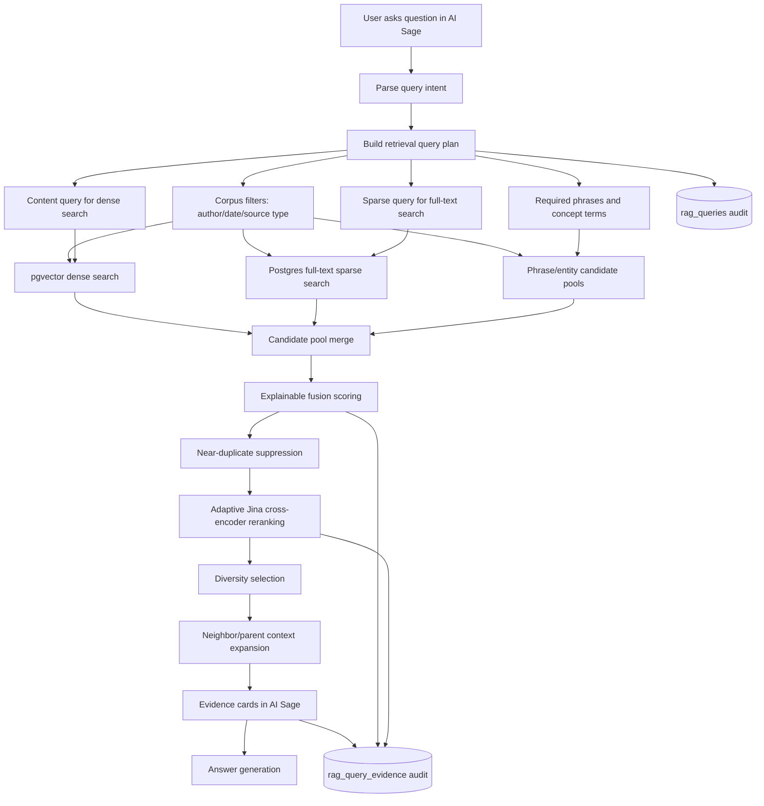

# RAG Retrieval Architecture

Retrieval is the part of AI Sage that takes a user question, searches the ingested author corpus, and returns the passages that should ground the answer.

In plain English: when you ask “What are Charlie Munger’s main mental models?”, retrieval decides where to search, what to search for, which passages look relevant, how to rank them, and what evidence to show in the UI.

## The Pieces

### Query Intent Parsing

The system reads the question and identifies what the user is asking for. It tries to detect authors, dates, source types, concepts, and whether the query is broad, single-author, multi-author, or open-ended.

### Source And Corpus Constraints

These are filters that decide which part of the corpus is allowed. If the query is about Charlie Munger, results should come from Charlie Munger’s corpus unless the user explicitly asks for broader comparison.

### Dense Search

Dense search means embedding search. The query and chunks are represented as vectors, then Postgres/pgvector finds chunks that are semantically close.

Example: dense search can match “how to avoid bad decisions” with a passage about “inversion” even if the exact words differ.

### Sparse Search

Sparse search means keyword/phrase search. It uses Postgres full-text search, including `websearch_to_tsquery`, to find exact words, names, phrases, years, and entities.

Example: sparse search is good for exact phrases like `"mental models"`, ticker symbols, dates, and named concepts.

### Candidate Pool

A candidate pool is a temporary list of possible evidence chunks from one retrieval method.

The system builds multiple pools because no single search method is reliable enough:

- dense pool for semantic matches
- sparse pool for lexical/phrase matches
- required-phrase pool for important exact phrases
- fallback pool when the primary plan is too narrow
- topic/entity pool when the query contains recognized entities

### Explainable Fusion

Fusion combines the candidate pools into one ranked list. “Explainable” means each chunk keeps diagnostics: which pool found it, phrase hits, concept hits, dense/sparse ranks, and final score components.

### Duplicate Suppression

The system removes or penalizes near-duplicate passages so the top results do not repeat the same evidence in slightly different chunks.

### Adaptive Cross-Encoder Reranking

A cross-encoder reranker scores each `(query, passage)` pair more carefully than vector or keyword search. Jina is the current configured provider when credentials are available.

Adaptive means the system does not blindly let Jina reorder everything. Broad synthesis questions can use stronger reranker movement; high-confidence exact queries use a protected blend so a good baseline ranking is not destroyed.

### Parent / Neighbor Context Delivery

Retrieval may find a precise child chunk, but the UI often needs nearby context. The system can deliver neighboring chunks or parent context around the selected evidence so the user can inspect the passage in context.

### Evidence Audit Output

The system records what happened: query plan, returned evidence, ranking scores, pool memberships, and answer metadata. This is used for debugging and evals.

## End-To-End Query Flow

## Concrete Example

Question:

> What are Charlie Munger’s main mental models?

The retrieval plan should treat “Charlie Munger” as the source/corpus constraint and “main mental models” as the content query.

Expected plan shape:

- corpus filter: `author_id = charlie_munger`
- dense query: `main mental models`
- sparse query: `"mental models" main`
- required phrase: `mental models`
- concept terms: `mental models`, `main`
- removed source-author terms: `Charlie Munger`, `Munger`

The important design point: chunks should not rank highly just because they repeat “Charlie Munger.” They should rank highly because they discuss relevant mental models such as inversion, incentives, psychology, base rates, margin of safety, and latticework.

## Technologies Used

| Step | Technology / Data |
| --- | --- |
| Intent parsing | deterministic parser plus optional LLM routing where needed |
| Dense search | Postgres + pgvector |
| Sparse search | Postgres full-text search with `websearch_to_tsquery` |
| Fusion | deterministic scoring in application code |
| Reranking | provider-swappable cross-encoder, currently Jina when configured |
| Context expansion | neighboring chunks from `rag_chunks` |
| Audit | `rag_queries`, `rag_query_evidence`, retrieval diagnostics metadata |

## Current State

Implemented:

- query planning that separates source-author constraints from content query
- dense pgvector retrieval
- sparse Postgres retrieval
- multiple candidate pools
- explainable scoring diagnostics
- duplicate suppression
- adaptive Jina/raw reranking when configured
- expanded context delivery
- query/evidence audit trails

Still needs improvement:

- broader query expansion for abstract concepts
- more golden-set coverage across authors and query types
- clearer UI/debug surfaces for each ranking step
- stronger company-analysis retrieval once company corpus exists

## Key Design Choices

1. **Author names are filters, not relevance terms.**
   A Munger query should search inside Munger’s corpus for the concept, not search globally for the words “Charlie Munger.”

2. **Dense and sparse search are both required.**
   Dense search finds semantic matches. Sparse search protects exact phrases, entities, dates, and transcript language.

3. **Candidate pools are explicit.**
   If a result is bad, we need to know whether the failure came from candidate recall, fusion, reranking, or context delivery.

4. **Reranking must be gated.**
   Rerankers can improve average metrics while hurting specific important queries. Evals decide whether a provider/config becomes default.

5. **Evidence comes before answer generation.**
   AI Sage answers should be constrained by retrieved evidence, not by fluent synthesis over weak sources.

## Alternatives Considered

- **Dense-only retrieval:** misses exact phrases and specific entities.
- **Sparse-only retrieval:** misses paraphrases and conceptual matches.
- **LLM reranking:** harder to make deterministic, inspectable, and cheap.
- **Always trusting Jina completely:** improved some averages but regressed specific queries before adaptive fusion.

## Why This Architecture

This architecture gives AI Sage three things it needs at the same time:

- recall: find enough possible evidence
- precision: rank the best evidence near the top
- auditability: explain why each result appeared
