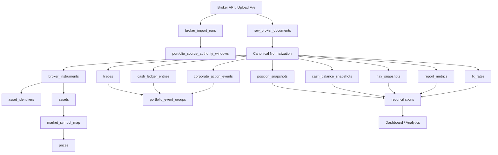

# Canonical Portfolio Data Model

This document defines the target CapitalOS portfolio data model for investment accounts. It is the architecture target for IBKR Flex, existing broker uploads, and future broker integrations.

Related implementation plans:

- [Issue 175: Canonical portfolio model and IBKR Flex cutover architecture](../../tasks/issue-175-ibkr-flex-broker-neutral-portfolio-ingestion.md)
- [Issue 176: Canonical portfolio phase 1 - IBKR Flex cutover](../../tasks/issue-176-canonical-portfolio-phase-1-ibkr-flex-cutover.md)
- [Issue 177: Canonical portfolio phase 2 - upload parser adapters](../../tasks/issue-177-canonical-portfolio-phase-2-upload-parser-adapters.md)
- [Issue 178: Canonical portfolio phase 3 - dashboard and analytics read migration](../../tasks/issue-178-canonical-portfolio-phase-3-dashboard-analytics-read-migration.md)

---

## Design Goal

CapitalOS should have one coherent portfolio domain model for investment platforms. "One model" does not mean one giant transactions table. It means every broker source normalizes into the same set of separated facts:

- instrument identity
- position snapshots
- cash balance snapshots
- NAV snapshots
- trade/execution ledger
- cash ledger
- corporate-action ledger
- broker report metrics
- FX rates
- raw source lineage
- data completeness and reconciliation

Each table answers a different financial question. Keeping them separate prevents double-counting and makes incomplete source data explicit.

---

## Core Principles

1. **Raw source data is immutable.** Store original broker payloads or upload files with hashes and import metadata before normalizing them.
2. **Canonical facts are separate from raw source rows.** Raw source rows are evidence; canonical tables are the normalized product model.
3. **Snapshots and ledgers are distinct.** Snapshots answer "what did I own"; ledgers answer "what changed and why".
4. **Source authority is explicit.** Only one source may be authoritative for an account/date/scope. Others are reference or disabled.
5. **Multi-currency is fundamental.** Store native currency, base currency, source FX rate, and base equivalent where applicable.
6. **Use exact decimal arithmetic.** Money, quantity, price, cost basis, NAV, FX, and P&L use `NUMERIC` / `Decimal`, never floating point.
7. **Completeness is data.** Missing trade history, missing FX, or upload-only holdings must be represented explicitly instead of inferred.
8. **Instrument identity is stronger than ticker.** Broker contracts, global identifiers, market-data symbols, and display assets are related but not identical.

---

## Current Legacy Model

The current investment data path writes mostly into:

| Table | Current role |
|---|---|
| `accounts` | User financial accounts. |
| `platforms` | Platform/broker/bank reference data. |
| `import_jobs` | Upload job metadata and reports. |
| `parser_registry` | Upload file signature to parser mapping. |
| `assets` | Current security/cash display table, keyed weakly by `(symbol, quote_currency)`. |
| `positions` | Snapshot-ish holdings table keyed by `(account_id, asset_id, as_of)`. |
| `transactions` | Generic spending, cash, and broker activity table. |
| `prices` | Market prices by asset/date/source. |
| `market_symbol_map` | Asset to exchange/provider symbol mapping. |

This remains available during migration. The target state is that investment-platform writes and reads go through the canonical portfolio model, with legacy tables either retired or compatibility-frozen.

---

## Target Model Overview



---

## Target DB Structure

The definitions below are logical target structures. Exact migrations may adjust column names, indexes, and enum implementation, but the ownership boundaries should stay intact.

### Broker Connections

`broker_connections` represents a configured source integration for a user/platform.

```text
broker_connections
- id BIGSERIAL PRIMARY KEY
- user_id BIGINT NOT NULL REFERENCES users(id)
- platform_code TEXT NOT NULL              # IBKR, SHAREKHAN, DBS_VICKERS
- connection_type TEXT NOT NULL            # flex_api | upload | manual
- status TEXT NOT NULL                     # active | disabled | needs_attention
- metadata_json JSONB NOT NULL DEFAULT '{}'
- created_at TIMESTAMPTZ NOT NULL
- updated_at TIMESTAMPTZ NOT NULL
```

Secrets do not belong in this table. API tokens stay in environment configuration or a future secret store.

### Broker Accounts

`broker_accounts` maps a broker account identity to a CapitalOS account.

```text
broker_accounts
- id BIGSERIAL PRIMARY KEY
- connection_id BIGINT NOT NULL REFERENCES broker_connections(id)
- account_id BIGINT NOT NULL REFERENCES accounts(id)
- broker_account_id TEXT NOT NULL
- base_currency TEXT NOT NULL
- account_name TEXT
- status TEXT NOT NULL                     # active | disabled
- flex_cutover_date DATE
- first_available_date DATE
- data_completeness_json JSONB NOT NULL DEFAULT '{}'
- created_at TIMESTAMPTZ NOT NULL
- updated_at TIMESTAMPTZ NOT NULL

UNIQUE (connection_id, broker_account_id)
```

### Source Authority Windows

`portfolio_source_authority_windows` is the database-backed write gate. It prevents collisions between sources such as IBKR CSV uploads and IBKR Flex for the same account/date/scope.

```text
portfolio_source_authority_windows
- id BIGSERIAL PRIMARY KEY
- broker_account_id BIGINT NOT NULL REFERENCES broker_accounts(id)
- platform_code TEXT NOT NULL
- source_kind TEXT NOT NULL                # ibkr_flex_daily | ibkr_flex_backfill | ibkr_csv_upload | sharekhan_upload | dbs_vickers_upload
- authority_scope TEXT NOT NULL            # holdings | cash | nav | trades | cash_activity | corporate_actions | fx | all
- effective_from_date DATE NOT NULL
- effective_to_date DATE
- authority_status TEXT NOT NULL           # authoritative | reference | disabled
- metadata_json JSONB NOT NULL DEFAULT '{}'
- created_at TIMESTAMPTZ NOT NULL
```

Rules:

- IBKR Flex is authoritative on/after the configured cutover date.
- IBKR manual uploads are reference/history after cutover.
- Sharekhan uploads remain authoritative for Sharekhan accounts until a future connector replaces them.
- DBS Vickers uploads remain authoritative for DBS Vickers accounts until a future connector replaces them.
- Importers must resolve exactly one matching authority row before writing authoritative canonical facts.

### Import Runs

`broker_import_runs` tracks one retrieval/parse/normalize attempt.

```text
broker_import_runs
- id BIGSERIAL PRIMARY KEY
- connection_id BIGINT NOT NULL REFERENCES broker_connections(id)
- broker_account_id BIGINT REFERENCES broker_accounts(id)
- source_type TEXT NOT NULL                # ibkr_flex_daily | ibkr_flex_backfill | upload
- status TEXT NOT NULL                     # started | fetched | parsed | imported | partial | failed
- requested_at TIMESTAMPTZ NOT NULL
- started_at TIMESTAMPTZ
- finished_at TIMESTAMPTZ
- report_start_date DATE
- report_end_date DATE
- parser_version TEXT NOT NULL
- error_code TEXT
- error_message_redacted TEXT
- stats_json JSONB NOT NULL DEFAULT '{}'
```

### Raw Broker Documents

`raw_broker_documents` stores immutable source evidence.

```text
raw_broker_documents
- id BIGSERIAL PRIMARY KEY
- import_run_id BIGINT NOT NULL REFERENCES broker_import_runs(id)
- document_type TEXT NOT NULL              # flex_xml | csv | xls | xlsx | html_table
- content_sha256 TEXT NOT NULL
- byte_size BIGINT NOT NULL
- stored_path TEXT NOT NULL
- content_type TEXT
- broker_report_id TEXT
- report_date DATE
- metadata_json JSONB NOT NULL DEFAULT '{}'
- created_at TIMESTAMPTZ NOT NULL

INDEX (content_sha256)
```

Raw XML/upload content must be retained securely. Secrets in request URLs are not stored.

### Legacy Position Backfill And Parity Audit

Issue 181 uses a migration bridge to copy eligible legacy `positions` facts into canonical storage without deleting `positions`.

Run the backfill for one user:

```bash
docker compose run --rm api python -m app.portfolio.legacy_backfill --user-id 1
```

Dry-run the same scope without writes:

```bash
docker compose run --rm api python -m app.portfolio.legacy_backfill --user-id 1 --dry-run
```

Generate the parity report at an explicit anchor date:

```bash
docker compose run --rm api python -m app.portfolio.parity_report --user-id 1 --anchor-date 2026-01-31
```

Interpretation:

- `net_worth.delta_total`, `delta_stock_fund`, and `delta_cash` should be zero or within rounding tolerance after backfill.
- `stock_holdings`, `cash_balances`, `platform_alloc`, and `geography_alloc` show row-level legacy-versus-canonical deltas.
- `summary.parity_ok` is true only when stock quantities and cash balances match.
- Legacy latest-row selection is anchored: both stock/fund and cash reads choose `MAX(as_of)` only from rows where `as_of <= anchor_date`.
- `portfolio_data_quality_events` records skipped/conflicting canonical facts so existing authoritative rows are not overwritten.

---

## Instrument And Stock Modeling

This is the most important distinction in the stock model:

| Concept | Meaning | Example |
|---|---|---|
| Broker instrument | A broker's tradable contract/listing. | IBKR `conid=152791428`, symbol `700`, exchange `SEHK`, currency `HKD`. |
| Asset | CapitalOS display/security record used by dashboard and market data. | Tencent Holdings HK ordinary share. |
| Identifier | A namespaced identifier for an asset or broker instrument. | `IBKR:CONID:152791428`, `GLOBAL:ISIN:...`. |
| Market symbol map | Provider/exchange quote mapping for an asset. | `HKEX:0700`, Yahoo `0700.HK`. |
| Price | Market data observation for an asset/date/source. | Price for asset 123 on 2026-06-19 from `yfinance_market`. |

Ticker and currency are not enough. Two different securities can share a ticker/currency across venues, and one issuer can have multiple tradable instruments.

### Broker Instruments

`broker_instruments` retains broker-specific contract facts even before they are mapped to an asset.

```text
broker_instruments
- id BIGSERIAL PRIMARY KEY
- platform_code TEXT NOT NULL              # IBKR
- broker_instrument_id TEXT NOT NULL       # conid for IBKR
- asset_id BIGINT REFERENCES assets(id)    # nullable until mapped
- symbol TEXT
- description TEXT
- asset_category TEXT                      # STK | OPT | BOND | FUND | CASH | OTHER
- currency TEXT
- listing_exchange TEXT
- metadata_json JSONB NOT NULL DEFAULT '{}'
- created_at TIMESTAMPTZ NOT NULL
- updated_at TIMESTAMPTZ NOT NULL

UNIQUE (platform_code, broker_instrument_id, listing_exchange, currency)
```

Mapping rules:

- `broker_instruments.asset_id` starts nullable.
- Automatic mapping requires a deterministic identifier match.
- Do not auto-map purely from ticker plus currency.
- Ambiguous broker instruments require manual review or explicit mapping.

### Asset Identifiers

`asset_identifiers` supports both broker-specific and global identifiers.

```text
asset_identifiers
- id BIGSERIAL PRIMARY KEY
- asset_id BIGINT NOT NULL REFERENCES assets(id)
- identifier_namespace TEXT NOT NULL        # IBKR | GLOBAL | YAHOO | EODHD
- identifier_type TEXT NOT NULL             # CONID | ISIN | FIGI | CUSIP | TICKER_EXCHANGE
- identifier_value TEXT NOT NULL
- metadata_json JSONB NOT NULL DEFAULT '{}'
- created_at TIMESTAMPTZ NOT NULL

UNIQUE (identifier_namespace, identifier_type, identifier_value)
```

Examples:

```text
IBKR / CONID / 152791428
GLOBAL / ISIN / US02079K3059
YAHOO / TICKER_EXCHANGE / GOOGL:US
```

### Assets

`assets` remains the dashboard-facing security/cash table during migration. It should evolve into a mapped display/security record, not the automatic identity source.

Current fields:

```text
assets
- id
- symbol
- name
- asset_class
- quote_currency
- home_country
```

Future migrations may add stronger canonical fields, but phase 1 should not destructively change this table.

### Market Symbol Map

`market_symbol_map` maps an asset to provider/exchange quote symbols.

```text
market_symbol_map
- asset_id
- exchange_code                 # US | HKEX | SGX | NSE
- exchange_symbol
- quote_currency
- is_active
- eodhd_symbol_override
- yahoo_symbol_override
```

This is not broker identity. It is market-data lookup identity.

### Price Observations

`prices` stores market price observations for mapped assets.

```text
prices
- asset_id
- ts
- price
- currency
- source
- trade_date
- exchange_code
- provider_symbol
```

Prices are used to value holdings where the broker report does not provide current valuation, or for non-broker market-data screens. For IBKR Flex daily NAV, broker NAV is the account total authority.

### Stock Modeling Examples

#### Tencent HK ordinary share

```text
broker_instrument:
  platform_code = IBKR
  broker_instrument_id = 152791428
  symbol = 700
  listing_exchange = SEHK
  currency = HKD
  asset_category = STK

asset:
  symbol = 700
  name = Tencent Holdings Ltd
  quote_currency = HKD
  home_country = HK

market_symbol_map:
  exchange_code = HKEX
  exchange_symbol = 700 or 0700 depending provider rules
  yahoo_symbol_override = 0700.HK
```

#### Tencent ADR

```text
broker_instrument:
  platform_code = IBKR
  symbol = TCEHY
  listing_exchange = PINK
  currency = USD
  asset_category = STK

asset:
  symbol = TCEHY
  quote_currency = USD
```

The HK ordinary share and ADR are separate tradable instruments. They may later be linked by issuer/economic exposure metadata, but they should not be merged as one holding.

#### Berkshire class B

Broker symbols can contain spaces or punctuation, while market data providers use different conventions.

```text
broker_instrument.symbol = BRK B
asset.symbol = BRK.B or BRK B depending current normalized record
market_symbol_map.yahoo_symbol_override = BRK-B
```

The provider symbol belongs in `market_symbol_map`, not in `broker_instruments`.

---

## Snapshot Tables

### Position Snapshots

`portfolio_position_snapshots` answers: what security quantity did I own on this report date?

```text
portfolio_position_snapshots
- id BIGSERIAL PRIMARY KEY
- broker_account_id BIGINT NOT NULL REFERENCES broker_accounts(id)
- account_id BIGINT NOT NULL REFERENCES accounts(id)
- broker_instrument_id BIGINT NOT NULL REFERENCES broker_instruments(id)
- asset_id BIGINT REFERENCES assets(id)
- report_date DATE NOT NULL
- quantity NUMERIC(38, 18) NOT NULL
- side TEXT                              # long | short
- currency TEXT NOT NULL
- mark_price_native NUMERIC(38, 18)
- market_value_native NUMERIC(38, 18)
- cost_basis_price_native NUMERIC(38, 18)
- cost_basis_native NUMERIC(38, 18)
- unrealized_pnl_native NUMERIC(38, 18)
- base_currency TEXT NOT NULL
- fx_rate_to_base NUMERIC(38, 18)
- market_value_base NUMERIC(38, 18)
- percent_of_nav NUMERIC(38, 18)
- source_authority_id BIGINT REFERENCES portfolio_source_authority_windows(id)
- authority_status TEXT NOT NULL
- source_kind TEXT NOT NULL
- source_document_id BIGINT REFERENCES raw_broker_documents(id)
- import_run_id BIGINT REFERENCES broker_import_runs(id)
- source_row_hash TEXT NOT NULL
- metadata_json JSONB NOT NULL DEFAULT '{}'

UNIQUE (broker_account_id, report_date, broker_instrument_id, currency)
  WHERE authority_status = 'authoritative'
```

### Cash Balance Snapshots

`portfolio_cash_balance_snapshots` answers: how much cash did I have by currency?

```text
portfolio_cash_balance_snapshots
- id BIGSERIAL PRIMARY KEY
- broker_account_id BIGINT NOT NULL REFERENCES broker_accounts(id)
- account_id BIGINT NOT NULL REFERENCES accounts(id)
- report_date DATE NOT NULL
- currency TEXT NOT NULL
- ending_cash_native NUMERIC(38, 18) NOT NULL
- ending_settled_cash_native NUMERIC(38, 18)
- base_currency TEXT NOT NULL
- fx_rate_to_base NUMERIC(38, 18)
- ending_cash_base NUMERIC(38, 18)
- source_authority_id BIGINT REFERENCES portfolio_source_authority_windows(id)
- authority_status TEXT NOT NULL
- source_kind TEXT NOT NULL
- source_document_id BIGINT REFERENCES raw_broker_documents(id)
- import_run_id BIGINT REFERENCES broker_import_runs(id)
- source_row_hash TEXT NOT NULL

UNIQUE (broker_account_id, report_date, currency)
  WHERE authority_status = 'authoritative'
```

Do not insert broker summary rows such as IBKR `BASE_SUMMARY` as currency cash.

### NAV Snapshots

`portfolio_nav_snapshots` answers: what did the broker say the whole account was worth?

```text
portfolio_nav_snapshots
- id BIGSERIAL PRIMARY KEY
- broker_account_id BIGINT NOT NULL REFERENCES broker_accounts(id)
- account_id BIGINT NOT NULL REFERENCES accounts(id)
- report_date DATE NOT NULL
- base_currency TEXT NOT NULL
- cash_base NUMERIC(38, 18)
- stock_base NUMERIC(38, 18)
- options_base NUMERIC(38, 18)
- bonds_base NUMERIC(38, 18)
- dividend_accruals_base NUMERIC(38, 18)
- interest_accruals_base NUMERIC(38, 18)
- total_nav_base NUMERIC(38, 18) NOT NULL
- source_authority_id BIGINT REFERENCES portfolio_source_authority_windows(id)
- authority_status TEXT NOT NULL
- source_kind TEXT NOT NULL
- source_document_id BIGINT REFERENCES raw_broker_documents(id)
- import_run_id BIGINT REFERENCES broker_import_runs(id)
- source_row_hash TEXT NOT NULL

UNIQUE (broker_account_id, report_date)
  WHERE authority_status = 'authoritative'
```

For IBKR Flex accounts, dashboard total should use `total_nav_base`, not holdings plus cash, because NAV can include accruals.

### Report Metrics

`portfolio_report_metrics` stores period-level broker metrics that are not individual events.

```text
portfolio_report_metrics
- id BIGSERIAL PRIMARY KEY
- broker_account_id BIGINT NOT NULL REFERENCES broker_accounts(id)
- report_date DATE NOT NULL
- period_start_date DATE
- period_end_date DATE
- report_section TEXT NOT NULL             # cash_report | change_in_nav
- metric_code TEXT NOT NULL                # deposits | dividends | withholding_tax | net_trades_sales
- currency TEXT
- amount_native NUMERIC(38, 18)
- amount_base NUMERIC(38, 18)
- source_document_id BIGINT REFERENCES raw_broker_documents(id)
- import_run_id BIGINT REFERENCES broker_import_runs(id)
- source_row_hash TEXT NOT NULL

UNIQUE (broker_account_id, report_date, report_section, metric_code, currency)
```

Examples:

- starting cash
- deposits
- withdrawals
- dividends
- commissions
- transaction tax
- withholding tax
- other fees
- net trades sales
- net trades purchases
- ending cash
- change in NAV

Do not store these as individual `portfolio_cash_ledger_entries`.

---

## Ledger Tables

### Event Groups

`portfolio_event_groups` links related economic event rows.

```text
portfolio_event_groups
- id BIGSERIAL PRIMARY KEY
- broker_account_id BIGINT NOT NULL REFERENCES broker_accounts(id)
- event_date DATE NOT NULL
- event_type TEXT NOT NULL                 # trade | dividend | fee | tax | transfer | corporate_action
- broker_trade_id TEXT
- broker_execution_id TEXT
- broker_transaction_id TEXT
- source_document_id BIGINT REFERENCES raw_broker_documents(id)
- metadata_json JSONB NOT NULL DEFAULT '{}'
```

### Trades

`portfolio_trades` answers: what did I buy or sell?

```text
portfolio_trades
- id BIGSERIAL PRIMARY KEY
- broker_account_id BIGINT NOT NULL REFERENCES broker_accounts(id)
- event_group_id BIGINT REFERENCES portfolio_event_groups(id)
- trade_date DATE NOT NULL
- settle_date DATE
- broker_trade_id TEXT
- broker_execution_id TEXT
- broker_order_id TEXT
- broker_instrument_id BIGINT REFERENCES broker_instruments(id)
- asset_id BIGINT REFERENCES assets(id)
- side TEXT NOT NULL                       # buy | sell
- quantity NUMERIC(38, 18) NOT NULL
- price_native NUMERIC(38, 18)
- gross_amount_native NUMERIC(38, 18)
- commission_native NUMERIC(38, 18)
- tax_native NUMERIC(38, 18)
- net_cash_native NUMERIC(38, 18)
- currency TEXT NOT NULL
- fx_rate_to_base NUMERIC(38, 18)
- source_authority_id BIGINT REFERENCES portfolio_source_authority_windows(id)
- authority_status TEXT NOT NULL
- source_document_id BIGINT REFERENCES raw_broker_documents(id)
- import_run_id BIGINT REFERENCES broker_import_runs(id)
- source_row_hash TEXT NOT NULL
```

Idempotency order:

1. Broker execution/trade ID.
2. Stable business fingerprint: account, datetime, conid, side, quantity, price, currency.
3. Source row hash only as final fallback.

### Cash Ledger Entries

`portfolio_cash_ledger_entries` answers: where did cash move?

```text
portfolio_cash_ledger_entries
- id BIGSERIAL PRIMARY KEY
- broker_account_id BIGINT NOT NULL REFERENCES broker_accounts(id)
- event_group_id BIGINT REFERENCES portfolio_event_groups(id)
- related_trade_id BIGINT REFERENCES portfolio_trades(id)
- date DATE NOT NULL
- settle_date DATE
- currency TEXT NOT NULL
- activity_code TEXT
- activity_type TEXT NOT NULL              # deposit | withdrawal | dividend | interest | fee | tax | trade_settlement | fx | transfer | other
- description TEXT
- amount_native NUMERIC(38, 18) NOT NULL
- balance_native NUMERIC(38, 18)
- external_flow_flag BOOLEAN NOT NULL DEFAULT FALSE
- broker_transaction_id TEXT
- broker_trade_id TEXT
- broker_instrument_id BIGINT REFERENCES broker_instruments(id)
- asset_id BIGINT REFERENCES assets(id)
- fx_rate_to_base NUMERIC(38, 18)
- amount_base NUMERIC(38, 18)
- source_authority_id BIGINT REFERENCES portfolio_source_authority_windows(id)
- authority_status TEXT NOT NULL
- source_document_id BIGINT REFERENCES raw_broker_documents(id)
- import_run_id BIGINT REFERENCES broker_import_runs(id)
- source_row_hash TEXT NOT NULL
```

Cash ledger entries explain movement. Cash snapshots state balances. Do not sum both as performance flows.

### Corporate Actions

`portfolio_corporate_action_events` answers: why did quantity or cost basis change without a normal trade?

```text
portfolio_corporate_action_events
- id BIGSERIAL PRIMARY KEY
- broker_account_id BIGINT NOT NULL REFERENCES broker_accounts(id)
- event_group_id BIGINT REFERENCES portfolio_event_groups(id)
- effective_date DATE NOT NULL
- broker_action_id TEXT
- action_type TEXT NOT NULL                # split | merger | spinoff | stock_dividend | symbol_change | transfer_in | transfer_out
- broker_instrument_id BIGINT REFERENCES broker_instruments(id)
- asset_id BIGINT REFERENCES assets(id)
- quantity_before NUMERIC(38, 18)
- quantity_after NUMERIC(38, 18)
- ratio NUMERIC(38, 18)
- cash_component_native NUMERIC(38, 18)
- currency TEXT
- description TEXT
- source_authority_id BIGINT REFERENCES portfolio_source_authority_windows(id)
- authority_status TEXT NOT NULL
- source_document_id BIGINT REFERENCES raw_broker_documents(id)
- import_run_id BIGINT REFERENCES broker_import_runs(id)
- source_row_hash TEXT NOT NULL
```

---

## FX, Reconciliation, And Completeness

### Broker FX Rates

```text
portfolio_fx_rates
- id BIGSERIAL PRIMARY KEY
- report_date DATE NOT NULL
- from_currency TEXT NOT NULL
- to_currency TEXT NOT NULL
- rate NUMERIC(38, 18) NOT NULL
- source_platform TEXT NOT NULL
- source_document_id BIGINT REFERENCES raw_broker_documents(id)
- import_run_id BIGINT REFERENCES broker_import_runs(id)

UNIQUE (report_date, from_currency, to_currency, source_platform)
```

Broker FX rates are reconciliation evidence. If a held currency lacks a broker FX rate for the report date, the broker import should be partial/failed rather than fabricating base valuation.

### Reconciliations

```text
portfolio_reconciliations
- id BIGSERIAL PRIMARY KEY
- broker_account_id BIGINT NOT NULL REFERENCES broker_accounts(id)
- report_date DATE NOT NULL
- reconciliation_type TEXT NOT NULL         # nav | cash | stock_value | ledger_cash_delta
- expected_amount_base NUMERIC(38, 18)
- actual_amount_base NUMERIC(38, 18)
- difference_base NUMERIC(38, 18)
- tolerance_base NUMERIC(38, 18)
- status TEXT NOT NULL                      # pass | warn | fail | unavailable
- details_json JSONB NOT NULL DEFAULT '{}'
- created_at TIMESTAMPTZ NOT NULL
```

IBKR NAV invariant:

```text
sum(position native value * FX rate to base)
+ sum(non-BASE_SUMMARY cash native value * FX rate to base)
+ dividend accruals
+ interest accruals
+ other supported asset buckets
= broker reported total NAV
```

### Data Completeness

```text
portfolio_data_completeness
- id BIGSERIAL PRIMARY KEY
- broker_account_id BIGINT NOT NULL REFERENCES broker_accounts(id)
- record_type TEXT NOT NULL                 # holdings | cash | nav | trades | cash_activity | corporate_actions | fx
- coverage_start_date DATE
- coverage_end_date DATE
- status TEXT NOT NULL                      # complete | partial | missing | unknown
- source TEXT NOT NULL
- notes TEXT
- metadata_json JSONB NOT NULL DEFAULT '{}'
```

Examples:

- Sharekhan holdings upload may be complete for holdings but missing NAV, cash, trades, and corporate actions.
- DBS Vickers holdings upload may be complete for holdings only.
- IBKR daily Flex may be complete for current snapshots but incomplete for historical trades until backfill.

---

## Ingestion Flows

### IBKR Flex Daily Flow

1. Acquire broker-account import lock.
2. Create `broker_import_runs`.
3. Call IBKR Flex `SendRequest`.
4. Poll `GetStatement` with bounded retry/backoff.
5. Persist raw XML in `raw_broker_documents`.
6. Parse XML with a real XML parser.
7. Resolve source authority window.
8. Upsert broker instruments and identifiers.
9. Upsert NAV, cash, position, report metric, and FX snapshots.
10. Run reconciliation.
11. Mark import run `imported`, `partial`, or `failed`.
12. Publish portfolio refresh event only after successful canonical write/read state.

### Upload Parser Flow

1. Existing upload endpoint receives file.
2. Existing `import_jobs` flow stores raw file and selects parser.
3. Parser returns existing `ParseResult`.
4. Canonical adapter converts parsed output into canonical facts.
5. Adapter resolves source authority window.
6. Adapter writes canonical rows and completeness records.
7. Legacy output remains unchanged until dashboard read migration completes.

---

## Dashboard Read Rules

Target state:

- Account totals read `portfolio_nav_snapshots` when NAV exists.
- Holdings read `portfolio_position_snapshots`.
- Cash reads `portfolio_cash_balance_snapshots`.
- Market price freshness uses mapped `assets`, `market_symbol_map`, and `prices`.
- Incomplete data and failed reconciliations are visible.

Important rule:

For IBKR Flex accounts, total portfolio value is canonical NAV. Holdings plus cash is only a breakdown and may exclude dividend accruals, interest accruals, or other broker NAV components.

---

## Migration Phases

### Phase 1: IBKR Flex Cutover

- Add canonical schema slice.
- Ingest IBKR Flex daily reports.
- Enforce IBKR source authority.
- Read IBKR account total from canonical NAV.
- Keep Sharekhan/DBS Vickers unchanged.

### Phase 2: Upload Parser Adapters

- Adapt existing upload parsers to canonical writes.
- Keep parser formats stable.
- Add equivalence tests for Sharekhan and DBS Vickers.
- Store completeness metadata for lower-detail uploads.

### Phase 3: Dashboard And Analytics Read Migration

- Move investment dashboard reads to canonical services.
- Compare canonical and legacy output before switching.
- Retire or compatibility-freeze legacy investment tables.

---

## Non-Goals

- This model does not replace bank/card spending categorization yet.
- This model does not implement autonomous trading.
- This model does not compute TWR/MWR until historical events and external flows are complete.
- This model does not automatically merge economically related instruments such as ordinary shares and ADRs.
