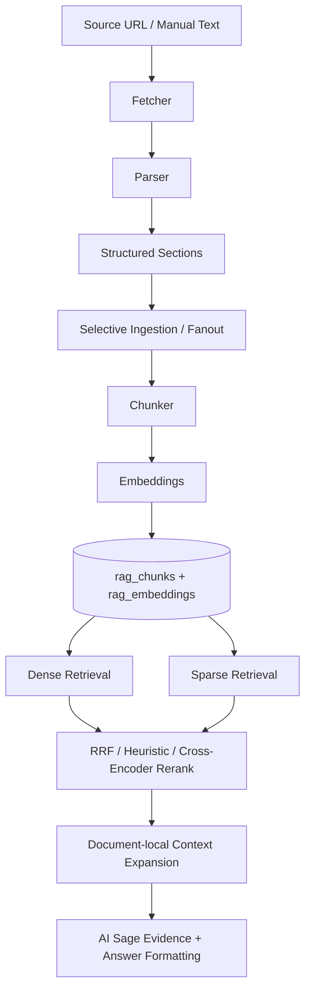

# RAG Ingestion And Retrieval As-Is

Last audited: 2026-05-07

This note is intentionally narrow. It answers the current implementation questions around parsing, tables, chunking, context expansion, and where those decisions live in code.

## Short answers

1. Parser:
   - PDF: `unstructured.io` is the preferred parser when installed and `RAG_PARSER_BACKEND != pdfminer`.
   - PDF fallback: `pdfminer.six`.
   - HTML: `BeautifulSoup` + `lxml`, not Unstructured, not LlamaParse.
   - Text/manual: pass-through text parsing.

2. Table representation:
   - Tables are converted to Markdown, not stored as HTML for chunking.
   - For PDFs parsed by Unstructured, HTML table payloads are converted into Markdown first.

3. LLM table summary:
   - Not implemented.
   - The raw Markdown table is preserved and chunked directly.
   - No separate table-summary text is generated during ingestion.

4. Semantic chunking:
   - Supported, but optional and off by default.
   - No spaCy or NLTK.
   - Sentence splitting is regex-based.
   - Topic-boundary detection uses adjacent sentence embeddings from the repo’s embedding pipeline.

5. Parent-child chunking:
   - Not implemented as a formal small-child / large-parent retrieval design.
   - Current behavior is document-local context expansion: retrieve a chunk, then expand it with neighboring chunks from the same document.
   - There is also a separate `parent_document_id` concept at the logical-document level from fanout ingestion, but that is not parent-child chunk retrieval.

## Code-verified architecture

## 1. Parsing

Primary file: [api/app/rag/ingestion/parser.py](/Users/hiteshjoshi/apps/capitalos/api/app/rag/ingestion/parser.py)

- PDF parser selection is in `parse_pdf_structured()`:
  - Unstructured preferred: lines 395-409
  - pdfminer fallback: lines 412-420
- Backend toggle:
  - `RAG_PARSER_BACKEND=unstructured|pdfminer`: lines 12-15, 392
- HTML parsing is currently BeautifulSoup-based:
  - structured HTML parser: lines 236-323
- `unstructured.partition.html` is imported, but not used in the current HTML parse path:
  - import exists at lines 47-48
  - no active call path uses it
- LlamaParse is not present in the repo.

Implication:
- Current parser stack is mixed:
  - PDF can be advanced-ish when Unstructured is installed
  - HTML is still deterministic BeautifulSoup parsing
  - There is no single unified document parser like LlamaParse across source types

## 2. Table preservation

Tables are preserved as Markdown.

Relevant code:
- HTML `<table>` to Markdown:
  - `_bs4_table_to_markdown()`: [parser.py](/Users/hiteshjoshi/apps/capitalos/api/app/rag/ingestion/parser.py:130)
- Unstructured PDF table HTML to Markdown:
  - `_html_table_to_markdown()`: [parser.py](/Users/hiteshjoshi/apps/capitalos/api/app/rag/ingestion/parser.py:152)
- HTML structured parser emits `content_type="table"` + `table_markdown`:
  - [parser.py](/Users/hiteshjoshi/apps/capitalos/api/app/rag/ingestion/parser.py:288)
- PDF structured parser emits `content_type="table"` + `table_markdown`:
  - [parser.py](/Users/hiteshjoshi/apps/capitalos/api/app/rag/ingestion/parser.py:362)
- Pipeline prefers `table_markdown` over raw table text for chunking:
  - [pipeline.py](/Users/hiteshjoshi/apps/capitalos/api/app/rag/ingestion/pipeline.py:121)

Implication:
- Row/column relationships are preserved better than flat text, but in Markdown form.
- We do not keep table HTML as the primary chunk content.

## 3. LLM summarization of tables

Not implemented in ingestion.

What happens today:
- table Markdown is passed straight into chunking:
  - [pipeline.py](/Users/hiteshjoshi/apps/capitalos/api/app/rag/ingestion/pipeline.py:125)
- table sections become chunks as-is:
  - [chunker.py](/Users/hiteshjoshi/apps/capitalos/api/app/rag/ingestion/chunker.py:453)

What does not exist:
- no ingestion-stage `table_summary`
- no LLM pass that converts table Markdown into a natural-language explanation
- no dual storage of `raw_markdown + derived_summary` specifically for tables

Implication:
- Searchability depends on the embedded Markdown table text itself.
- If a table uses terse labels or ambiguous headers, retrieval quality will be weaker than a summary-augmented design.

## 4. Chunking

Primary file: [api/app/rag/ingestion/chunker.py](/Users/hiteshjoshi/apps/capitalos/api/app/rag/ingestion/chunker.py)

Current chunker has two layers:

1. Recursive chunking:
- paragraphs -> sentences -> words
- code:
  - `_recursive_split()`: [chunker.py](/Users/hiteshjoshi/apps/capitalos/api/app/rag/ingestion/chunker.py:148)
  - `_greedy_merge()`: [chunker.py](/Users/hiteshjoshi/apps/capitalos/api/app/rag/ingestion/chunker.py:180)

2. Optional semantic chunking:
- controlled by `RAG_CHUNKING_SEMANTIC`
- uses sentence embeddings and cosine similarity of adjacent sentences
- code:
  - `_detect_topic_boundaries()`: [chunker.py](/Users/hiteshjoshi/apps/capitalos/api/app/rag/ingestion/chunker.py:285)
  - semantic path in `chunk_recursive()`: [chunker.py](/Users/hiteshjoshi/apps/capitalos/api/app/rag/ingestion/chunker.py:389)

Important implementation details:
- token counting uses `tiktoken` when available, fallback estimate otherwise:
  - [chunker.py](/Users/hiteshjoshi/apps/capitalos/api/app/rag/ingestion/chunker.py:32)
- sentence splitting is regex-based:
  - [chunker.py](/Users/hiteshjoshi/apps/capitalos/api/app/rag/ingestion/chunker.py:104)
- no spaCy
- no NLTK

Structured chunking:
- `chunk_structured()` keeps section boundaries intact and keeps tables atomic:
  - [chunker.py](/Users/hiteshjoshi/apps/capitalos/api/app/rag/ingestion/chunker.py:418)

Implication:
- The old “paragraph-only naive chunker” description is no longer accurate.
- The current implementation is materially better than that, but semantic chunking still depends on an env flag and is not always active in production.

## 5. Parent-child context behavior

### What exists

Document-local context expansion after retrieval:
- `expand_chunks_with_context()` pulls neighboring chunks from the same document:
  - [retrieval.py](/Users/hiteshjoshi/apps/capitalos/api/app/rag/retrieval.py:284)
- This expanded text is attached as `context_text` and used later by AI Sage:
  - [api/app/services/ai_sage.py](/Users/hiteshjoshi/apps/capitalos/api/app/services/ai_sage.py:460)

Logical-document parent relationships from fanout:
- `rag_documents.parent_document_id`:
  - [models/rag.py](/Users/hiteshjoshi/apps/capitalos/api/app/models/rag.py:214)
- linked during ingestion fanout:
  - [pipeline.py](/Users/hiteshjoshi/apps/capitalos/api/app/rag/ingestion/pipeline.py:301)

### What does not exist

Formal parent-child chunk retrieval:
- no separate small child chunk table plus large parent chunk table
- no “retrieve child, deliver parent chunk” retrieval tier
- no chunk-level parent pointer model

Implication:
- We preserve some local context, but this is not the same as a true parent-child retrieval architecture.

## 6. Retrieval stack as of now

Primary files:
- [api/app/rag/retrieval.py](/Users/hiteshjoshi/apps/capitalos/api/app/rag/retrieval.py)
- [api/app/rag/concept_mode.py](/Users/hiteshjoshi/apps/capitalos/api/app/rag/concept_mode.py)
- [api/app/rag/reranker.py](/Users/hiteshjoshi/apps/capitalos/api/app/rag/reranker.py)

As-is:
- dense retrieval via pgvector
- sparse retrieval via Postgres full-text search
- hybrid retrieval via Reciprocal Rank Fusion:
  - [retrieval.py](/Users/hiteshjoshi/apps/capitalos/api/app/rag/retrieval.py:538)
- dedicated reranker support exists for:
  - Cohere
  - Jina
  - local sentence-transformers cross-encoder
  - [reranker.py](/Users/hiteshjoshi/apps/capitalos/api/app/rag/reranker.py:1)

This matters because some older docs in the repo still describe the system as vector-only or LLM-rerank-only. That is no longer true.

## 7. Documentation status

Current state:
- There is an older broad doc at [docs/rag-pipeline-architecture.md](/Users/hiteshjoshi/apps/capitalos/docs/rag-pipeline-architecture.md).
- It is useful for historical context, but parts of it are stale relative to the current codebase.
- Before this note, there was no short, up-to-date “what is actually running now?” document focused on parser/chunker/retrieval decisions.

This file is intended to fill that gap.
