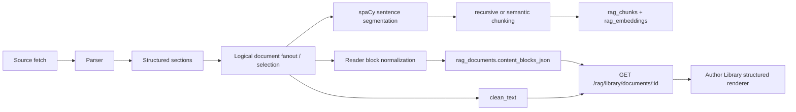

# RAG Structured Reader Architecture

Last audited: 2026-05-08

## Scope

This document explains the reader-fidelity path introduced for Issue 162:

1. structured parsing survives ingestion instead of collapsing into `clean_text`
2. tables are stored in both retrieval-friendly and display-friendly forms
3. the Author Library reader renders typed blocks when available
4. chunking now uses spaCy sentence segmentation as the default path

## As-is before Issue 162

Before this change, parser structure was only partially retained in memory:

- HTML/PDF parsing could emit logical sections and table Markdown
- `rag_documents` persisted `raw_text` and `clean_text`, but not a reader block model
- `GET /rag/library/documents/{document_id}` returned `clean_text` only
- the Author Library reader rendered one pre-wrapped text blob
- sentence splitting in `api/app/rag/ingestion/chunker.py` used regex as the primary strategy

That meant tables were flattened in the reader, prose hierarchy was lost, and semantic chunking inherited brittle sentence boundaries.

## Target behavior after Issue 162

The pipeline now persists a first-party structured reader payload on `rag_documents.content_blocks_json`.

Each block is ordered and citation-ready:

```json
{
  "block_id": "blk-0003",
  "type": "table",
  "order": 3,
  "level": null,
  "text": null,
  "items": null,
  "table_markdown": "| Metric | Value |",
  "table_rows": [["Metric", "Value"], ["ROE", "15%"]],
  "metadata": {
    "heading_context": "Capital Allocation"
  }
}
```

### Reader rules

- prefer `content_blocks` over `clean_text`
- keep `clean_text` for backward compatibility and legacy documents
- render `heading`, `paragraph`, `list`, `quote`, and `table` blocks directly
- render normalized tables as HTML tables with horizontal overflow
- fall back to readable preformatted table text only when rows cannot be normalized

### Chunking rules

- recursive chunking uses spaCy `blank("en")` + `sentencizer`
- semantic chunking reuses the same spaCy sentence boundaries when enabled
- regex sentence splitting remains only as a guarded fallback for environments where spaCy cannot be imported

## End-to-end flow



## Parser -> persistence contract

### Structured sections

The parser emits `DocumentSection` items with:

- `content_type`: `heading | text | list | quote | table`
- `heading` and `level` for section hierarchy
- `items` for list fidelity
- `table_markdown` for audit/retrieval fidelity
- `table_rows` for display fidelity
- `metadata.heading_context` so future citation deep-links can land within a section

### Persisted document model

`rag_documents` now stores:

- `raw_text`
- `clean_text`
- `metadata_json`
- `content_blocks_json`

`content_blocks_json` is the first-party reader surface. `clean_text` remains the compatibility field for old clients, old documents, and chunking/retrieval lineage.

## Tables: retrieval vs display

Tables are intentionally stored twice:

1. `table_markdown`
   - good for auditability
   - stable for retrieval/chunk text lineage
   - preserved in the reader payload
2. `table_rows`
   - good for browser rendering
   - keeps row/column alignment intact
   - used by the Author Library table UI

Known limitation: complex PDF tables with merged cells may still normalize imperfectly. When that happens, the reader falls back to readable table-oriented text instead of collapsing the table into paragraph prose.

## Sentence segmentation after spaCy migration

The chunker no longer treats regex as the normal production strategy.

- Primary path: spaCy sentencizer
- Fallback path: regex splitter
- Why: finance prose, decimals, abbreviations, transcript Q&A, and wrapped text all segment more reliably with spaCy's deterministic sentence boundary engine

Semantic chunking remains opt-in, but it is now testable on the same stronger sentence boundary base used by recursive chunking.

## Reingestion and backfill

- newly ingested or re-ingested documents populate `content_blocks_json`
- existing documents without `content_blocks_json` continue rendering through `clean_text`
- operators should re-ingest high-value author documents if they want full table and structured-reader fidelity on older corpus entries

## Verification

Backend and reader changes are verifiable with the standard Make targets plus curl:

1. `make api-rebuild`
2. `curl http://localhost:8000/health`
3. `curl http://localhost:8000/dashboard/summary?month=2026-02`
4. `curl http://localhost:8000/openapi.json`
5. `make contract-backend`
6. `make test-backend`
7. `make lint`
8. `make typecheck`
9. `make contract-frontend`
10. `make test-frontend`
11. `make api-smoke`
